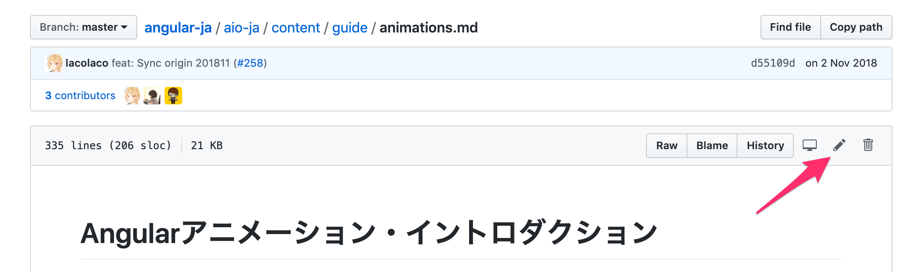

# angular-jaへのコントリビューション

## ファイル構成

- `origin`: `angular/angular` リポジトリをsubmodule管理しています
- `aio-ja`: 翻訳の原文ファイル `xxx.en.md` と 翻訳ファイル `.md` 、その他 `origin` を上書きするためのファイルを管理しています。

### aioディレクトリの構成

基本的には `content`ディレクトリ内のMarkdownファイルに対して翻訳をおこないます。
その他必要に応じて、アプリケーションのソースコードにも手を加えます。

https://github.com/angular/angular/tree/master/aio

```
origin/aio/
├── README.md
├── content # MarkdownやHTMLなどで書かれたドキュメンテーションのリソースファイル。主にここのファイルを翻訳する
│   ├── cli # CLIドキュメントのリソース
│   ├── examples # サンプルコードのソースコード
│   ├── guide # ガイドドキュメントのリソース
│   ├── images # ドキュメンテーション中の画像
│   ├── marketing # リンク集やイベント情報など、Angular紹介用のリソース
│   ├── start # 入門チュートリアルのリソース
│   ├── navigation.json # サイトの各種ナビゲーションの管理ファイル
│   └── tutorial # Tour of Heroes チュートリアルのリソース
├── src # angular.ioアプリケーションのソースコード
...
```

## 翻訳作業の流れ

翻訳作業を開始する前に、同じファイルを翻訳しようとしている人がいないかどうかを確認しましょう。
[Translation Checkout](https://github.com/angular/angular-ja/labels/type%3A%20Translation%20Checkout)ラベルのイシューを見ると、現在翻訳に取り掛かっている領域がわかります。
新しく翻訳をおこないたい場合は、まず[イシューを作成](https://github.com/angular/angular-ja/issues/new/choose)し、テンプレートにしたがって情報を記入してください。

## 軽微な修正

すでに翻訳されたドキュメントの軽微な修正は、GitHub上の `Edit` 機能でプルリクエストを作成してください。



## 翻訳の追加

未翻訳のドキュメントをあらたに翻訳するには、原文ファイルを `xxx.en.md` として `origin` から `aio-ja` へコピーし、その原文に対する翻訳を `xxx.md` として作成します。
その2つのファイルを追加するプルリクエストを提出してください。

### ローカル環境のセットアップ

#### 1. リポジトリのクローン

```
$ git clone git@github.com:angular/angular-ja.git
```

#### 2. originリポジトリの同期

このリポジトリではsubmoduleを使って翻訳元リポジトリと統合しています。

```
$ git submodule sync
$ git submodule update --init
```
#### 開発用サーバーを使った作業

開発用サーバーを起動すると、ビルド結果を確認しながら翻訳作業ができます。
開発用サーバーの起動中は、`aio-ja/content`内のファイルが変更されたときに自動的に再ビルドされます。

```
$ yarn start
```

**注意**

- 事前に[Docker](https://www.docker.com/get-started)の実行環境を用意してください。
- 初回はDockerイメージのビルド時間が長いので、コーヒーを淹れながら待ちます。
- Dockerイメージサイズが10GB程度と非常に大きいため、ホストマシンのストレージ残量に注意してください。

#### ビルド

次のコマンドでデプロイ可能な生成物をビルドします。

```
$ yarn build
```

ビルドが完了すると、 `build-out` ディレクトリにビルド結果が出力されます。
好みのツールで開発サーバーを立ててビルドされたサイトを確認できます。

**注意**

- 事前に[Docker](https://www.docker.com/get-started)の実行環境を用意してください。
- ビルド時間がとても長いので、コーヒーを淹れながら待ちます。
- MacOSにおいて、ビルド処理の途中でOSのファイルディスクリプタを使い切ってしまうことがあります。
  その場合は次のように最大数を増やす必要があります。

https://github.com/meteor/meteor/issues/8057#issuecomment-261011063

```
$ echo kern.maxfiles=65536 | sudo tee -a /etc/sysctl.conf
$ echo kern.maxfilesperproc=65536 | sudo tee -a /etc/sysctl.conf
$ sudo sysctl -w kern.maxfiles=65536
$ sudo sysctl -w kern.maxfilesperproc=65536
$ ulimit -n 65536
```

### 翻訳イシューの作成

翻訳作業を開始する前に、同じファイルを翻訳しようとしている人がいないかどうかを確認しましょう。
[Translation Checkout](https://github.com/angular/angular-ja/labels/type%3A%20Translation%20Checkout)ラベルのイシューを見ると、現在翻訳に取り掛かっている領域がわかります。
新しく翻訳をおこないたい場合は、まず[イシューを作成](https://github.com/angular/angular-ja/issues/new/choose)し、テンプレートにしたがって情報を記入してください。

### 翻訳プルリクエストの作成

angular/angular-jaをフォークしたリポジトリに変更をプッシュし、フォーク元にプルリクエストを提出します。
プルリクエストはレビューされたのち、問題がなければマージされます

## 翻訳のガイドライン

日本語への翻訳は、以下のガイドラインに従ってください。

### 原文を `.en.md` ファイルとして保存する

originを更新したあとの原文自体のdiffを管理するために、翻訳した時点の原文を `xxx.en.md` ファイルとして保存します。
新たに翻訳する場合は、英語で書かれた `xxx.md` ファイルを `xxx.en.md` ファイルにコピーし、コピー元の `xxx.md` ファイルを上書き編集します。

### 改行位置を原文と揃える

可能な限り、原文と翻訳文の行数を揃え、更新時のdiffチェックが楽になるように協力してください。

### textlintに従う

基本的な表記ゆれの統一はtextlintを利用して自動修正できるようにしています。
もしtextlintでエラーが検出されれば、CIで検知され、プルリクエストがmergeできません。

### 原文のニュアンスを維持する

ドキュメンテーションは技術文書であるため、日本語としての読みやすさを維持しながら、なるべく原文のニュアンスを保ち、意訳は最低限にとどめます。

慣れるまでは、Google翻訳などの機械翻訳をベースに、Angular特有の用語などを修正するようにして進めるのがおすすめです。

### カタカナ語の表記について

日本語に翻訳することが難しい単語は、カタカナ語に置き換えることがあります。
外来語をカタカナに変換するルールは、原則として文化庁による[外来語の表記][]に従うものとします。
ただし、特別な文脈であったり、通例的な表記が存在する場合は例外を認めるものとします。

[外来語の表記]: https://www.bunka.go.jp/kokugo_nihongo/sisaku/joho/joho/kijun/naikaku/gairai/

### `Dangling Links Found` について: アンカーの追加

ビルドすると次のようなエラーが発生することがあります。

```
warn:    Dangling Links Found in "guide/deployment.json":
 - guide/browser-support#polyfills
warn:    Dangling Links Found in "guide/deprecations.json":
 - guide/releases#deprecation-practices,
 - guide/component-styles#deprecated-deep--and-ng-deep
warn:    Dangling Links Found in "guide/glossary.json":
 - guide/workspace-config#project-tool-configuration-options,
 - guide/workspace-config#project-tool-configuration-options
warn:    Dangling Links Found in "api/common/NgForOf.json":
 - guide/template-syntax#template-reference-variables--var-
error:   Error: 6 unmatched links
```

このエラーは、ドキュメンテーション内の相対リンクで、リンク先が見つからないことを警告しているものです。
上記の1番上の例では、 `guide/deployment` の中から `guide/browser-support#polyfills` へリンクしているにもかかわらず、 `guide/browser-support` ページに `#polyfills` という見出しが存在しないことを警告しています。

このエラーは `#` で始まる見出し部分を翻訳したときにしばしば発生します。リンクの参照を解決するために、翻訳文の中にアンカーを追加する必要があります。次のように、翻訳後の見出しに `{@a xxxxxx}` という形式のディレクティブを付与してください。

```md

## ポリフィル {@a polyfills}

```
