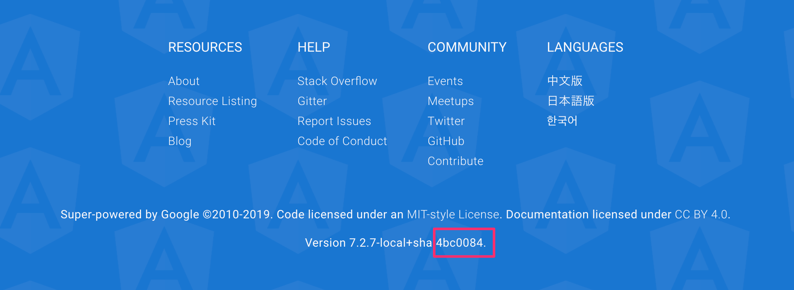

# angular.io のオリジナルコンテンツを更新する方法

## 事前準備

- node_modules の準備
- Git submodule の準備

## Workflow

1. `update-origin.sh` を編集する

`aioHash` を最新の angular.io のフッターから取得します。



```sh
aioHash="4bc0084"
```

2. `update-origin.sh` を実行します

3. 変更をマイグレーションします


## マイグレーション

### Pattern 1. オリジナルからオリジナル

- `foobar.md` (not translated)
- `contributors.json`
- `resouces.json`
- `presskit.html`

翻訳済みファイルが存在しないものは、そのまま適用します。

### Pattern 2. 翻訳済みのオリジナルファイル

- `foobar.en.md`
- `index.en.html`

#### 変更が小さい場合

変更点に再翻訳の必要があれば翻訳済みファイルへ反映します。

#### 変更が大きい場合

1. 未翻訳状態のまま、翻訳済みファイルの該当箇所へオリジナルのテキストをコピーし、日英混在の状態にします。
2. 未翻訳の部分について翻訳を募集するIssueを作成します。

### Pattern 3. aio アプリケーションコード

angular.io のアプリケーションを改変するためにいくつかのファイルが変更されていますが、gitの更新によってその変更が消されてしまいます。

- `navigation.model.ts`
- `nav-item.component.html`
- `doc-viewer.component.ts`
- `githubLinks.html`

これらのファイルについては、必要な変更はそのままにし、それ以外の変更があれば手動でマージします。
