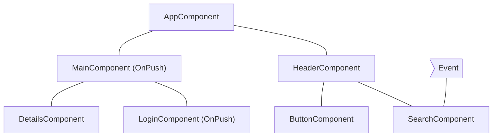
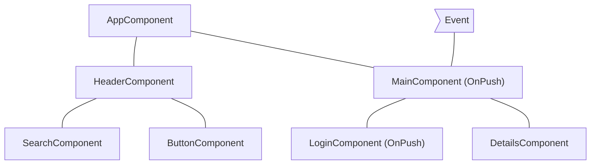
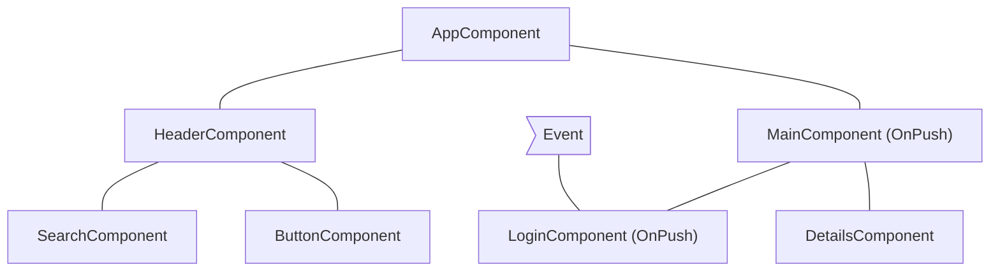
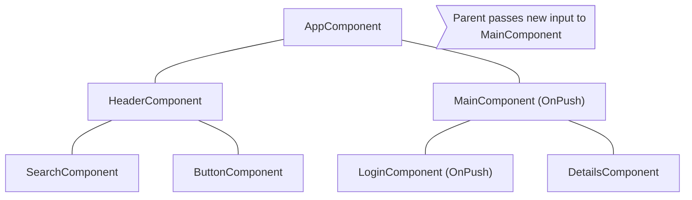

# コンポーネントサブツリーをスキップする

JavaScriptは、デフォルトでは、複数の異なるコンポーネントから参照できる可変データ構造を使用します。Angularは、データ構造の最新の状態がDOMに反映されるように、コンポーネントツリー全体で変更検知を実行します。

変更検知は、ほとんどのアプリケーションにとって十分に高速です。ただし、アプリケーションが特に大きなコンポーネントツリーを持っている場合、アプリケーション全体で変更検知を実行すると、パフォーマンスの問題が発生する可能性があります。これは、コンポーネントツリーのサブセットでのみ変更検知が実行されるように構成することで対処できます。

アプリケーションの一部が状態変化の影響を受けないと確信できる場合は、[OnPush](/api/core/ChangeDetectionStrategy)を使用して、コンポーネントのサブツリー全体の変更検知をスキップできます。

## `OnPush`の使用

OnPush変更検知は、Angularにコンポーネントのサブツリーの変更検知を次の場合**のみ**実行するように指示します。

* サブツリーのルートコンポーネントが、テンプレートバインディングの結果として新しいインプットを受け取った場合。Angularは、インプットの現在と過去の値を`==`で比較します。
* Angularが、OnPush変更検知を使用しているかどうかに関係なく、サブツリーのルートコンポーネント、または、その子でイベント *(例えば、イベントバインディング、アウトプットバインディング、または`@HostListener`を使用)* を処理する場合。

コンポーネントの変更検知戦略を`@Component`デコレーターで`OnPush`に設定できます。

```ts
import { ChangeDetectionStrategy, Component } from '@angular/core';
@Component({
  changeDetection: ChangeDetectionStrategy.OnPush,
})
export class MyComponent {}
```

## 一般的な変更検知のシナリオ

このセクションでは、Angularの動作を説明するために、いくつかの一般的な変更検知のシナリオを検証します。

### デフォルトの変更検知を持つコンポーネントによってイベントが処理される場合

Angularが`OnPush`戦略なしでコンポーネント内でイベントを処理する場合、フレームワークはコンポーネントツリー全体で変更検知を実行します。Angularは、新しいインプットを受け取っていない、`OnPush`を使用しているルートを持つ子孫コンポーネントのサブツリーをスキップします。

例として、`MainComponent`の変更検知戦略を`OnPush`に設定し、ユーザーが`MainComponent`をルートとするサブツリーの外部のコンポーネントとやり取りする場合、`MainComponent`が新しいインプットを受け取らない限り、Angularは下の図のすべてのピンク色のコンポーネント（`AppComponent`、`HeaderComponent`、`SearchComponent`、`ButtonComponent`）をチェックします:



## OnPushを持つコンポーネントによってイベントが処理される場合

AngularがOnPush戦略を持つコンポーネント内でイベントを処理する場合、フレームワークはコンポーネントツリー全体で変更検知を実行します。Angularは、新しいインプットを受け取っておらず、イベントを処理したコンポーネントの外部にある、OnPushを使用しているルートを持つコンポーネントのサブツリーを無視します。

例として、Angularが`MainComponent`内でイベントを処理する場合、フレームワークはコンポーネントツリー全体で変更検知を実行します。Angularは、`LoginComponent`をルートとするサブツリーを無視します。これは、`LoginComponent`が`OnPush`を持ち、イベントがそのスコープ外で発生したためです。



## OnPushを持つコンポーネントの子孫によってイベントが処理される場合

AngularがOnPushを持つコンポーネントでイベントを処理する場合、フレームワークはコンポーネントの祖先を含め、コンポーネントツリー全体で変更検知を実行します。

例として、下の図では、AngularはOnPushを使用する`LoginComponent`でイベントを処理します。Angularは、`MainComponent`に`OnPush`があるにもかかわらず、`MainComponent`（`LoginComponent`の親）を含め、コンポーネントのサブツリー全体で変更検知を呼び出します。Angularは、`LoginComponent`がそのビューの一部であるため、`MainComponent`もチェックします。



## OnPushを持つコンポーネントへの新しいインプット

Angularは、テンプレートバインディングの結果としてインプットプロパティを設定するときに、`OnPush`を持つ子コンポーネント内で変更検知を実行します。

例えば、下の図では、`AppComponent`が`OnPush`を持つ`MainComponent`に新しいインプットを渡します。Angularは`MainComponent`で変更検知を実行しますが、同じく`OnPush`を持っている`LoginComponent` は新しいインプットを受け取らない限り変更検知を実行しません。



## エッジケース

* **TypeScriptコードでインプットプロパティを変更する**。`@ViewChild`や`@ContentChild`のようなAPIを使用して、TypeScriptでコンポーネントへの参照を取得し、`@Input`プロパティを手動で変更すると、AngularはOnPushコンポーネントの変更検知を自動的に実行しません。Angularに変更検知を実行させる必要がある場合は、コンポーネントに`ChangeDetectorRef`を注入し、`changeDetectorRef.markForCheck()`を呼び出して、Angularに変更検知をスケジュールするように指示できます。
* **オブジェクト参照の変更**。インプットが可変オブジェクトを値として受け取り、オブジェクトを変更しても参照を保持する場合、Angularは変更検知を呼び出しません。これは、インプットの以前の値と現在の値が同じ参照を指していることによる想定通りの動作です。
