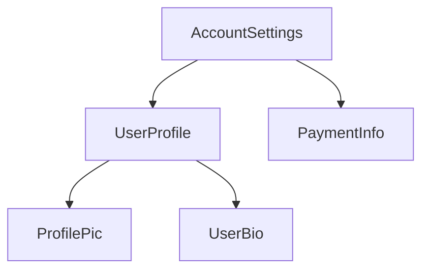

<docs-decorative-header title="コンポーネントの構造" imgSrc="adev/src/assets/images/components.svg"> <!-- markdownlint-disable-line -->
</docs-decorative-header>

TIP: このガイドでは、すでに[基本概念のガイド](essentials)を読んでいることを前提としています。Angularを初めて使う場合は、まずそちらをお読みください。

すべてのコンポーネントには次のものが必要です。

* ユーザー入力の処理やサーバーからのデータ取得などの*動作*を定義するTypeScriptクラス
* DOMにレンダリングされる内容を制御するHTMLテンプレート
* HTMLでコンポーネントがどのように使用されるかを定義する[CSSセレクター](https://developer.mozilla.org/docs/Learn/CSS/Building_blocks/Selectors)

TypeScriptクラスの上部に `@Component` [デコレーター](https://www.typescriptlang.org/docs/handbook/decorators.html) を追加することで、コンポーネントにAngular固有の情報を与えます。

<docs-code language="angular-ts" highlight="[1, 2, 3, 4]">
@Component({
  selector: 'profile-photo',
  template: ``,
})
export class ProfilePhoto { }
</docs-code>

データバインディング、イベント処理、制御フローなど、Angularテンプレート作成に関する詳細は、[テンプレートガイド](guide/templates)を参照してください。

`@Component` デコレーターに渡されるオブジェクトは、コンポーネントの**メタデータ**と呼ばれます。これには、このガイドで説明されている `selector`、`template`、その他のプロパティが含まれています。

コンポーネントには、オプションでそのコンポーネントのDOMに適用されるCSSスタイルのリストを含めることができます。

<docs-code language="angular-ts" highlight="[4]">
@Component({
  selector: 'profile-photo',
  template: ``,
  styles: `img { border-radius: 50%; }`,
})
export class ProfilePhoto { }
</docs-code>

デフォルトでは、コンポーネントのスタイルは、そのコンポーネントのテンプレートで定義された要素にのみ影響を与えます。Angularのスタイリングアプローチの詳細については、[コンポーネントのスタイリング](guide/components/styling)を参照してください。

テンプレートとスタイルを別々のファイルにも記述できます。

<docs-code language="angular-ts" highlight="[3, 4]">
@Component({
  selector: 'profile-photo',
  templateUrl: 'profile-photo.html',
  styleUrl: 'profile-photo.css',
})
export class ProfilePhoto { }
</docs-code>

これにより、プロジェクト内の_表示_と_動作_の懸念事項を分離できます。プロジェクト全体に対して1つのアプローチを選択するか、コンポーネントごとにどちらを使用するかを決定できます。

`templateUrl`と`styleUrl`の両方は、コンポーネントが存在するディレクトリを基準とした相対パスです。

## コンポーネントの使用

### `@Component`デコレーターでのインポート

コンポーネント、[ディレクティブ](guide/directives)、または[パイプ](guide/templates/pipes)を使用するには、
`@Component`デコレーターの`imports`配列に追加する必要があります。

```angular-ts
import {ProfilePhoto} from './profile-photo';

@Component({
  // このコンポーネントのテンプレートで使用するために、
  // `ProfilePhoto`コンポーネントをインポートします。
  imports: [ProfilePhoto],
  /* ... */
})
export class UserProfile { }
```

デフォルトでは、Angularコンポーネントは*スタンドアロン*です。つまり、他のコンポーネントの`imports`配列に直接追加できます。以前のバージョンのAngularで作成されたコンポーネントは、代わりに`@Component`デコレーターで`standalone: false`を指定している場合があります。これらのコンポーネントの場合、代わりにコンポーネントが定義されている`NgModule`をインポートします。詳細は、完全な[`NgModule`ガイド](guide/ngmodules)を参照してください。

IMPORTANT: 19.0.0より前のAngularバージョンでは、`standalone`オプションはデフォルトで`false`です。

### テンプレートでのコンポーネントの表示

すべてのコンポーネントは[CSSセレクター](https://developer.mozilla.org/docs/Learn/CSS/Building_blocks/Selectors)を定義します。

<docs-code language="angular-ts" highlight="[2]">
@Component({
  selector: 'profile-photo',
  ...
})
export class ProfilePhoto { }
</docs-code>

Angularがサポートするセレクターの種類と、セレクターの選択に関するガイダンスについては、[コンポーネントセレクター](guide/components/selectors)を参照してください。

_他の_コンポーネントのテンプレートで一致するHTML要素を作成することで、コンポーネントを表示します。

<docs-code language="angular-ts" highlight="[8]">
@Component({
  selector: 'profile-photo',
})
export class ProfilePhoto { }

@Component({
  imports: [ProfilePhoto],
  template: `<profile-photo />`
})
export class UserProfile { }
</docs-code>

Angularは、遭遇する一致するHTML要素ごとにコンポーネントのインスタンスを作成します。コンポーネントのセレクターと一致するDOM要素は、そのコンポーネントの**ホスト要素**と呼ばれます。コンポーネントのテンプレートの内容はそのホスト要素内にレンダリングされます。

コンポーネントによってレンダリングされるDOM（コンポーネントのテンプレートに対応）は、
そのコンポーネントの**ビュー**と呼ばれます。

このようにコンポーネントを構成することで、**Angularアプリケーションをコンポーネントのツリーと考えることができます**。




このツリー構造は、[依存性の注入](guide/di)や[子クエリ](guide/components/queries)など、他のいくつかのAngularの概念を理解する上で重要です。
