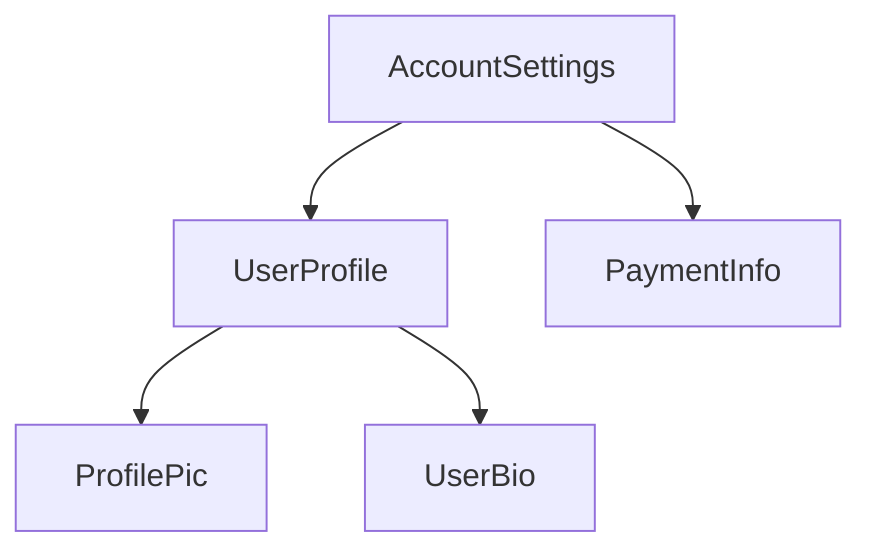

<docs-decorative-header title="コンポーネントの構造" imgSrc="adev/src/assets/images/components.svg"> <!-- markdownlint-disable-line -->
</docs-decorative-header>

ヒント: このガイドでは、すでに[基本ガイド](essentials)を読んでいることを前提としています。Angular を初めて使用する場合は、まずそちらを読んでください。

すべてのコンポーネントには、次のものが必要です。

* ユーザー入力の処理やサーバーからのデータの取得など、_動作_ を持つ TypeScript クラス
* DOM にレンダリングされる内容を制御する HTML テンプレート
* HTML でコンポーネントがどのように使用されるかを定義する[CSS セレクター](https://developer.mozilla.org/docs/Learn/CSS/Building_blocks/Selectors)

TypeScript クラスの上に `@Component` [デコレーター](https://www.typescriptlang.org/docs/handbook/decorators.html) を追加することで、コンポーネントに Angular 固有の情報を提供します。

<docs-code language="ts" highlight="[1, 2, 3, 4]">
@Component({
  selector: 'profile-photo',
  template: ``,
})
export class ProfilePhoto { }
</docs-code>

Angular テンプレートの書き方については、[テンプレートガイド](guide/templates)を参照してください。

`@Component` デコレーターに渡されるオブジェクトは、コンポーネントの**メタデータ**と呼ばれます。これには、`selector`、`template`、およびこのガイド全体で説明されているその他のプロパティが含まれます。

コンポーネントには、そのコンポーネントの DOM に適用される CSS スタイルのリストをオプションで含めることができます。

<docs-code language="ts" highlight="[4]">
@Component({
  selector: 'profile-photo',
  template: ``,
  styles: `img { border-radius: 50%; }`,
})
export class ProfilePhoto { }
</docs-code>

デフォルトでは、コンポーネントのスタイルは、そのコンポーネントのテンプレートで定義された要素のみに影響します。Angular のスタイリングに関するアプローチの詳細については、[コンポーネントのスタイリング](guide/components/styling)を参照してください。

テンプレートとスタイルを別々のファイルに書くこともできます。

<docs-code language="ts" highlight="[3, 4]">
@Component({
  selector: 'profile-photo',
  templateUrl: 'profile-photo.html',
  styleUrl: 'profile-photo.css',
})
export class ProfilePhoto { }
</docs-code>

これにより、プロジェクト内の_プレゼンテーション_と_動作_の懸念を分離できます。プロジェクト全体で一貫したアプローチを選択することも、コンポーネントごとにどちらを使用するかを決定することもできます。

`templateUrl` と `styleUrl` はどちらも、コンポーネントが存在するディレクトリからの相対パスです。

## コンポーネントの使用

すべてのコンポーネントは、[CSS セレクター](https://developer.mozilla.org/docs/Learn/CSS/Building_blocks/Selectors) を定義しています。

<docs-code language="ts" highlight="[2]">
@Component({
  selector: 'profile-photo',
  ...
})
export class ProfilePhoto { }
</docs-code>

Angular がサポートするセレクターの種類や、セレクターの選択に関するガイダンスについては、[コンポーネントセレクター](guide/components/selectors)を参照してください。

コンポーネントは、_他の_コンポーネントのテンプレートで一致する HTML 要素を作成することで使用します。

<docs-code language="ts" highlight="[4]">
@Component({
  selector: 'user-profile',
  template: `
    <profile-photo />
    <button>Upload a new profile photo</button>`,
  ...,
})
export class UserProfile { }
</docs-code>

テンプレートで他のコンポーネントを参照して使用する方法は、[コンポーネントのインポートと使用](guide/components/importing)を参照してください。

Angular は、遭遇したすべてのマッチする HTML 要素に対して、コンポーネントのインスタンスを作成します。コンポーネントのセレクターと一致する DOM 要素は、そのコンポーネントの**ホスト要素**と呼ばれます。コンポーネントのテンプレートの内容は、そのホスト要素内にレンダリングされます。

コンポーネントによってレンダリングされた DOM（コンポーネントのテンプレートに対応）は、そのコンポーネントの**ビュー**と呼ばれます。

このようにコンポーネントを組み合わせることで、**Angular アプリケーションはコンポーネントのツリーとして考えることができます**。

このツリー構造は、[依存性の注入](guide/di)や[子クエリ](guide/components/queries)など、他のいくつかの Angular の概念を理解する上で重要です。
