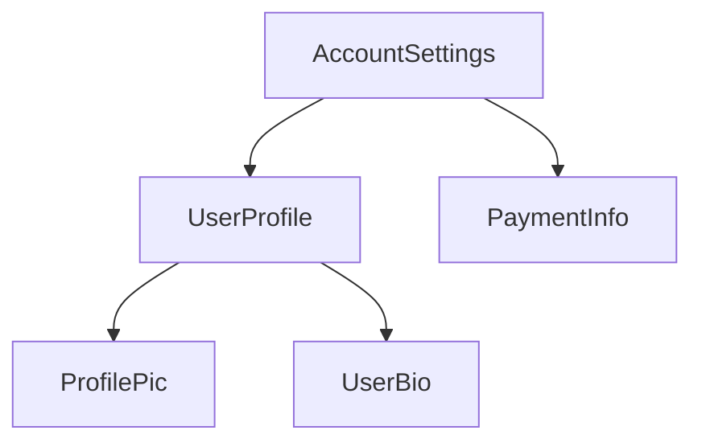

<docs-decorative-header title="コンポーネントの構造" imgSrc="adev/src/assets/images/components.svg"> <!-- markdownlint-disable-line -->
</docs-decorative-header>

ヒント: このガイドでは、すでに[基本概念のガイド](essentials)を読んでいることを前提としています。Angularを初めて使う場合は、まずそちらをお読みください。

すべてのコンポーネントには次のものが必要です。

* ユーザー入力の処理やサーバーからのデータ取得などの*動作*を定義するTypeScriptクラス
* DOMにレンダリングされる内容を制御するHTMLテンプレート
* HTMLでコンポーネントがどのように使用されるかを定義する[CSSセレクター](https://developer.mozilla.org/docs/Learn/CSS/Building_blocks/Selectors)

TypeScriptクラスの上部に `@Component` [デコレーター](https://www.typescriptlang.org/docs/handbook/decorators.html) を追加することで、コンポーネントにAngular固有の情報を与えます。

<docs-code language="ts" highlight="[1, 2, 3, 4]">
@Component({
  selector: 'profile-photo',
  template: ``,
})
export class ProfilePhoto { }
</docs-code>

Angularテンプレートの書き方については、[テンプレートガイド](guide/templates)を参照してください。

`@Component` デコレーターに渡されるオブジェクトは、コンポーネントの**メタデータ**と呼ばれます。これには、このガイドで説明されている `selector`、`template`、その他のプロパティが含まれています。

コンポーネントには、オプションでそのコンポーネントのDOMに適用されるCSSスタイルのリストを含めることができます。

<docs-code language="ts" highlight="[4]">
@Component({
  selector: 'profile-photo',
  template: ``,
  styles: `img { border-radius: 50%; }`,
})
export class ProfilePhoto { }
</docs-code>

デフォルトでは、コンポーネントのスタイルは、そのコンポーネントのテンプレートで定義された要素にのみ影響を与えます。Angularのスタイリングアプローチの詳細については、[コンポーネントのスタイリング](guide/components/styling)を参照してください。

代わりに、テンプレートとスタイルを別々のファイルに書くこともできます。

<docs-code language="ts" highlight="[3, 4]">
@Component({
  selector: 'profile-photo',
  templateUrl: 'profile-photo.html',
  styleUrl: 'profile-photo.css',
})
export class ProfilePhoto { }
</docs-code>

これにより、プロジェクト内の*プレゼンテーション*と*動作*の懸念を分離できます。プロジェクト全体で一貫したアプローチを選択することも、コンポーネントごとに使用するものを決定できます。

`templateUrl` と `styleUrl` はどちらも、コンポーネントが存在するディレクトリを基準とした相対パスです。

## コンポーネントの使用

すべてのコンポーネントは[CSSセレクター](https://developer.mozilla.org/docs/Learn/CSS/Building_blocks/Selectors)を定義します。

<docs-code language="ts" highlight="[2]">
@Component({
  selector: 'profile-photo',
  ...
})
export class ProfilePhoto { }
</docs-code>

Angularがサポートするセレクターの種類と、セレクターを選択する際のガイダンスについては、[コンポーネントセレクター](guide/components/selectors)を参照してください。

他のコンポーネントのテンプレートに一致するHTML要素を作成することで、コンポーネントを使用します。

<docs-code language="ts" highlight="[4]">
@Component({
  selector: 'user-profile',
  template: `
    <profile-photo />
    <button>Upload a new profile photo</button>`,
  ...,
})
export class UserProfile { }
</docs-code>

テンプレートで他のコンポーネントを参照して使用する方法は、[コンポーネントのインポートと使用](guide/components/importing)を参照してください。

Angularは、遭遇した一致するHTML要素ごとに、コンポーネントのインスタンスを作成します。コンポーネントのセレクターに一致するDOM要素は、そのコンポーネントの**ホスト要素**と呼ばれます。コンポーネントのテンプレートの内容は、そのホスト要素内にレンダリングされます。

コンポーネントによってレンダリングされたDOM (コンポーネントのテンプレートに対応)は、
そのコンポーネントの**ビュー**と呼ばれます。

このようにコンポーネントを組み合わせることで、**Angular アプリケーションはコンポーネントのツリーとして考えることができます**。

このツリー構造は、[依存性の注入](guide/di)や[子クエリ](guide/components/queries)など、その他のAngularの概念を理解する上で重要です。
