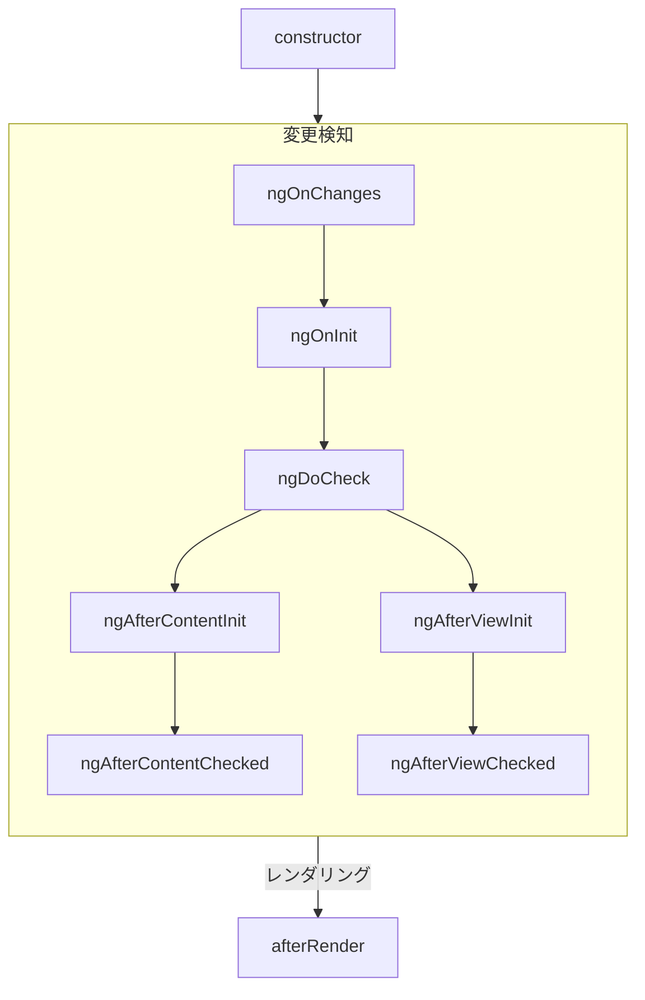
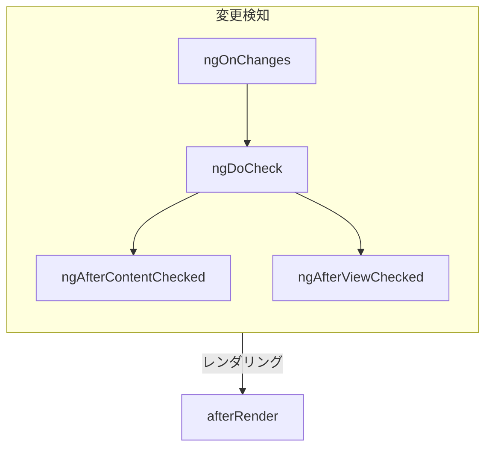

# コンポーネントライフサイクル

Tip: このガイドは、[基本概念のガイド](essentials) を既にお読みになっていることを前提としています。Angularを初めて使用する場合は、まずそちらをお読みください。

コンポーネントの**ライフサイクル**とは、コンポーネントの作成から破棄までの間に起こる一連のステップのことです。
各ステップは、Angularがコンポーネントをレンダリングし、
時間の経過とともに更新をチェックするプロセスにおける異なる部分を表しています。

コンポーネントでは、これらのステップ中にコードを実行するために**ライフサイクルフック**を実装できます。
特定のコンポーネントインスタンスに関連するライフサイクルフックは、コンポーネントクラスのメソッドとして実装されます。
Angularアプリケーション全体に関連するライフサイクルフックは、
コールバックを受け取る関数として実装されます。

コンポーネントのライフサイクルは、Angularが時間の経過とともにコンポーネントの変更をチェックする方法と密接に関連しています。
このライフサイクルを理解するために必要なのは、Angularがアプリケーションツリーを上から下に歩き、
テンプレートバインディングの変更をチェックすることだけです。
以下で説明するライフサイクルフックは、Angularがこのトラバーサルを実行している間に実行されます。
このトラバーサルは、各コンポーネントをちょうど1回だけ訪問するため、
プロセス中にさらに状態を変更することは避けるべきです。

## 概要

<div class="docs-table docs-scroll-track-transparent">
  <table>
    <tr>
      <td><strong>フェーズ</strong></td>
      <td><strong>メソッド</strong></td>
      <td><strong>概要</strong></td>
    </tr>
    <tr>
      <td>作成</td>
      <td><code>constructor</code></td>
      <td>
        <a href="https://developer.mozilla.org/docs/Web/JavaScript/Reference/Classes/constructor" target="_blank">
          標準の JavaScript クラスコンストラクター
        </a>。Angular がコンポーネントをインスタンス化するときに実行されます。
      </td>
    </tr>
    <tr>
      <td rowspan="7">変更検知</td>
      <td><code>ngOnInit</code>
      </td>
      <td>Angular がコンポーネントのすべての入力を初期化した後に1回実行されます。</td>
    </tr>
    <tr>
      <td><code>ngOnChanges</code></td>
      <td>コンポーネントの入力が変更されるたびに実行されます。</td>
    </tr>
    <tr>
      <td><code>ngDoCheck</code></td>
      <td>このコンポーネントが変更のためにチェックされるたびに実行されます。</td>
    </tr>
    <tr>
      <td><code>ngAfterContentInit</code></td>
      <td>コンポーネントの<em>コンテンツ</em>が初期化された後に1回実行されます。</td>
    </tr>
    <tr>
      <td><code>ngAfterContentChecked</code></td>
      <td>このコンポーネントのコンテンツが変更のためにチェックされるたびに実行されます。</td>
    </tr>
    <tr>
      <td><code>ngAfterViewInit</code></td>
      <td>コンポーネントの<em>ビュー</em>が初期化された後に1回実行されます。</td>
    </tr>
    <tr>
      <td><code>ngAfterViewChecked</code></td>
      <td>コンポーネントのビューが変更のためにチェックされるたびに実行されます。</td>
    </tr>
    <tr>
      <td rowspan="2">レンダリング</td>
      <td><code>afterNextRender</code></td>
      <td><strong>すべての</strong>コンポーネントがDOMにレンダリングされた次の時間に1回実行されます。</td>
    </tr>
    <tr>
      <td><code>afterRender</code></td>
      <td><strong>すべての</strong>コンポーネントがDOMにレンダリングされるたびに実行されます。</td>
    </tr>
    <tr>
      <td>破棄</td>
      <td><code>ngOnDestroy</code></td>
      <td>コンポーネントが破棄される直前に1回実行されます。</td>
    </tr>
  </table>
</div>

### ngOnInit

`ngOnInit` メソッドは、Angularがすべてのコンポーネントの入力を初期値で初期化した後に実行されます。
コンポーネントの `ngOnInit` は、ちょうど1回だけ実行されます。

このステップは、コンポーネント自身のテンプレートが初期化される<em>前</em>に発生します。
これは、初期入力値に基づいてコンポーネントの状態を更新できることを意味します。

### ngOnChanges

`ngOnChanges` メソッドは、コンポーネントの入力が変更された後に実行されます。

このステップは、コンポーネント自身のテンプレートがチェックされる<em>前</em>に発生します。
これは、初期入力値に基づいてコンポーネントの状態を更新できることを意味します。

初期化中は、最初の `ngOnChanges` は `ngOnInit` の前に実行されます。

#### 変更の検査

`ngOnChanges` メソッドは、1つの `SimpleChanges` 引数を受け取ります。
このオブジェクトは、[`Record`](https://www.typescriptlang.org/docs/handbook/utility-types.html#recordkeys-type) であり、
各コンポーネントの入力名を `SimpleChange` オブジェクトにマッピングします。
各 `SimpleChange` には、入力の以前の値、現在の値、
および入力が初めて変更されたかどうかを示すフラグが含まれています。

```ts
@Component({
  /* ... */
})
export class UserProfile {
  @Input() name: string = '';

  ngOnChanges(changes: SimpleChanges) {
    for (const inputName in changes) {
      const inputValues = changes[inputName];
      console.log(`Previous ${inputName} == ${inputValues.previousValue}`);
      console.log(`Current ${inputName} == ${inputValues.currentValue}`);
      console.log(`Is first ${inputName} change == ${inputValues.firstChange}`);
    }
  }
}
```

入力プロパティに `alias` を指定した場合、`SimpleChanges` Recordは、エイリアスではなく、
TypeScriptプロパティ名をキーとして使用します。

### ngOnDestroy

`ngOnDestroy` メソッドは、コンポーネントが破棄される直前に1回だけ実行されます。
Angularは、コンポーネントがページに表示されなくなった場合（`NgIf` によって隠された場合や、別のページに移動した場合など）、
コンポーネントを破棄します。

#### DestroyRef

`ngOnDestroy` メソッドの代わりに、`DestroyRef` のインスタンスを注入できます。
コンポーネントの破棄時に呼び出されるコールバックを登録するには、
`DestroyRef` の `onDestroy` メソッドを呼び出します。

```ts
@Component({
  /* ... */
})
export class UserProfile {
  constructor(private destroyRef: DestroyRef) {
    destroyRef.onDestroy(() => {
      console.log('UserProfile destruction');
    });
  }
}
```

`DestroyRef` インスタンスを、
コンポーネント外部の関数やクラスに渡すことができます。
このパターンは、コンポーネントが破棄されたときにクリーンアップを実行する必要がある他のコードがある場合に使用します。

`DestroyRef` を使用して、クリーンアップコードをすべて `ngOnDestroy` メソッドに置くのではなく、
クリーンアップコードに近い場所にセットアップコードを保持できます。

### ngDoCheck

`ngDoCheck` メソッドは、
Angularがコンポーネントのテンプレートの変更をチェックするたびに実行されます。

このライフサイクルフックを使用して、Angularの通常の変更検知の外部で状態の変更を手動でチェックし、コンポーネントの状態を手動で更新できます。

このメソッドは非常に頻繁に実行され、ページのパフォーマンスに大きく影響する可能性があります。
可能な限り、このフックの定義を避け、代替手段がない場合にのみ使用してください。

初期化中は、最初の `ngDoCheck` は `ngOnInit` の後に実行されます。

### ngAfterContentInit

`ngAfterContentInit` メソッドは、
コンポーネント（その*コンテンツ*）内にネストされたすべての子が初期化された後に1回だけ実行されます。

このライフサイクルフックを使用して、
[コンテンツクエリ](guide/components/queries#content-queries) の結果を読み取ることができます。
これらのクエリの初期化された状態にアクセスできますが、このメソッドで状態を変更しようとすると、
[ExpressionChangedAfterItHasBeenCheckedError](errors/NG0100) が発生します。

### ngAfterContentChecked

`ngAfterContentChecked` メソッドは、
コンポーネント（その*コンテンツ*）内にネストされたすべての子が変更のためにチェックされるたびに実行されます。

このメソッドは非常に頻繁に実行され、ページのパフォーマンスに大きく影響する可能性があります。
可能な限り、このフックの定義を避け、代替手段がない場合にのみ使用してください。

[コンテンツクエリ](guide/components/queries#content-queries)
の更新された状態にアクセスできますが、
このメソッドで状態を変更しようとすると、
[ExpressionChangedAfterItHasBeenCheckedError](errors/NG0100) が発生します。

### ngAfterViewInit

`ngAfterViewInit` メソッドは、
コンポーネントのテンプレート（その*ビュー*）内のすべての子が初期化された後に1回だけ実行されます。

このライフサイクルフックを使用して、
[ビュークエリ](guide/components/queries#view-queries) の結果を読み取ることができます。
これらのクエリの初期化された状態にアクセスできますが、このメソッドで状態を変更しようとすると、
[ExpressionChangedAfterItHasBeenCheckedError](errors/NG0100) が発生します。

### ngAfterViewChecked

`ngAfterViewChecked` メソッドは、
コンポーネントのテンプレート（その*ビュー*）内のすべての子が変更のためにチェックされるたびに実行されます。

このメソッドは非常に頻繁に実行され、ページのパフォーマンスに大きく影響する可能性があります。
可能な限り、このフックの定義を避け、代替手段がない場合にのみ使用してください。

[ビュークエリ](guide/components/queries#view-queries) 
の更新された状態にアクセスできますが、
このメソッドで状態を変更しようとすると、
[ExpressionChangedAfterItHasBeenCheckedError](errors/NG0100) が発生します。

### afterRender と afterNextRender

`afterRender` と `afterNextRender` 関数は、
Angularがページ上の*すべてのコンポーネント*をDOMにレンダリングし終えた後に呼び出される**レンダリングコールバック** を登録できます。

これらの関数は、このガイドで説明した他のライフサイクルフックとは異なります。
クラスメソッドではなく、コールバックを受け取るスタンドアロン関数です。
レンダリングコールバックの実行は、特定のコンポーネントインスタンスに結び付けられるのではなく、アプリケーション全体のフックに結び付けられます。

`afterRender` と `afterNextRender` は、
[注入コンテキスト](guide/di/dependency-injection-context)（通常はコンポーネントのコンストラクター）
で呼び出す必要があります。

レンダリングコールバックを使用して、手動でDOMを操作できます。
AngularでDOMを操作する方法については、[DOM API の使用](guide/components/dom-apis) を参照してください。

レンダリングコールバックは、サーバーサイドレンダリング中またはビルド時の事前レンダリング中は実行されません。

#### afterRender フェーズ

`afterRender` または `afterNextRender` を使用する場合、
オプションで作業をフェーズに分割できます。
フェーズを使用すると、DOM操作のシーケンスを制御でき、[レイアウトのスラッシング](https://web.dev/avoid-large-complex-layouts-and-layout-thrashing) を最小限に抑えるために、
*書き込み*操作を*読み込み*操作の前にシーケンスできます。
フェーズ間で通信するために、フェーズ関数は、
次のフェーズでアクセスできる結果値を返すことができます。

```ts
import {Component, ElementRef, afterNextRender} from '@angular/core';

@Component({...})
export class UserProfile {
  private prevPadding = 0;
  private elementHeight = 0;

  constructor(elementRef: ElementRef) {
    const nativeElement = elementRef.nativeElement;

    afterNextRender({
      // `Write` フェーズを使用して、ジオメトリのプロパティに書き込みます。
      write: () => {
        const padding = computePadding();
        const changed = padding !== this.prevPadding;
        if (changed) {
          nativeElement.style.padding = padding;
        }
        return changed; // 何か変更があったかどうかを `Read` フェーズに伝えます。
      },

      // `Read` フェーズを使用して、すべての書き込みが完了した後にジオメトリのプロパティを読み取ります。
      read: (didWrite) => {
        if (didWrite) {
          this.elementHeight = nativeElement.getBoundingClientRect().height;
        }
      }
    });
  }
}
```

フェーズは4つあり、次の順序で実行されます。

| フェーズ              | 説明                                                                                                                                                                                                      |
| --------------------- | --------------------------------------------------------------------------------------------------------------------------------------------------------------------------------------------------- |
| `earlyRead`        | このフェーズを使用して、その後の計算に厳密に必要な、レイアウトに影響を与えるDOMプロパティとスタイルを読み取ります。可能な限り、このフェーズを避け、`write` フェーズと `read` フェーズを優先します。     |
| `mixedReadWrite`    | デフォルトのフェーズ。レイアウトに影響を与えるプロパティとスタイルを読み書きする必要がある操作に使用します。可能な限り、このフェーズを避け、明示的な `write` フェーズと `read` フェーズを優先します。  |
| `write`             | このフェーズを使用して、レイアウトに影響を与えるDOMプロパティとスタイルを書き込みます。                                                                                                                     |
| `read`              | このフェーズを使用して、レイアウトに影響を与えるDOMプロパティを読み取ります。                                                                                                                              |

## ライフサイクルインターフェース

Angularは、各ライフサイクルメソッド用のTypeScriptインターフェースを提供します。
これらのインターフェースをインポートして `implement` することで、
実装に誤字脱字がないことを保証できます。

各インターフェースは、`ng` プレフィックスのない対応するメソッドと同じ名前を持っています。
たとえば、`ngOnInit` のインターフェースは `OnInit` です。

```ts
@Component({
  /* ... */
})
export class UserProfile implements OnInit {
  ngOnInit() {
    /* ... */
  }
}
```

## 実行順序

次の図は、Angularのライフサイクルフックの実行順序を示しています。

### 初期化中



### 後続の更新



### ディレクティブとの順序付け

テンプレートまたは `hostDirectives` プロパティで、コンポーネントと同じ要素に1つ以上のディレクティブを配置する場合、
フレームワークは単一の要素上のコンポーネントとディレクティブの間で特定のライフサイクルフックの順序を保証しません。
観察された順序に依存しないでください。
これは、Angularの以降のバージョンで変更される可能性があります。
