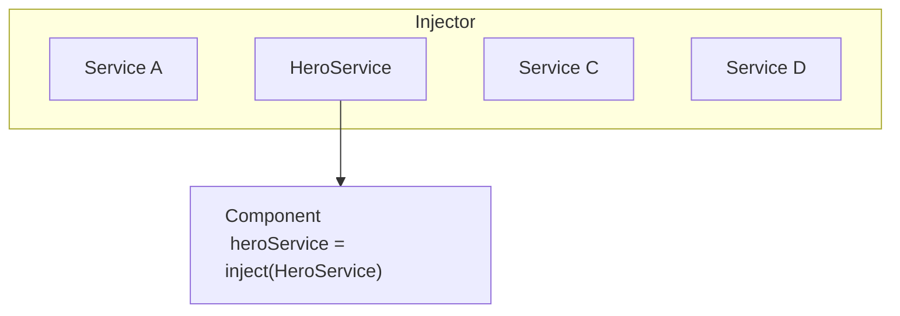

# 依存性の注入について

依存性の注入 (DI) はAngularの基本的な概念の1つです。DIはAngularフレームワークに組み込まれており、コンポーネント、ディレクティブ、パイプ、注入可能などのAngularデコレーターを持つクラスが、必要な依存関係を設定できるようにします。

DIシステムには、依存関係のコンシューマーと依存関係のプロバイダーという2つの主要な役割があります。

Angularは `Injector` という抽象化を使用して、依存関係のコンシューマーと依存関係のプロバイダー間の相互作用を促進します。依存関係が要求されると、インジェクターは、そのレジストリにすでにインスタンスが存在するかどうかを確認します。存在しない場合は、新しいインスタンスが作成され、レジストリに格納されます。Angularは、アプリケーションのブートストラップ処理中に、アプリケーション全体で使用されるインジェクター（「ルート」インジェクターとも呼ばれます）を作成します。ほとんどの場合、インジェクターを手動で作成する必要はありませんが、プロバイダーとコンシューマーを結び付けるレイヤーがあることを知っておく必要があります。

このトピックでは、クラスが依存関係としてどのように機能するかという基本的なシナリオについて説明します。Angularでは、関数やオブジェクト、文字列やブール値などのプリミティブ型あるいはその他の型も依存関係として使用できます。詳細については、[依存関係のプロバイダー](guide/di/dependency-injection-providers) を参照してください。

## 依存関係を提供する

コンポーネントで依存関係として機能する必要がある `HeroService` というクラスを考えてみましょう。

最初のステップは、`@Injectable` デコレーターを追加して、クラスを注入できることを示すことです。

<docs-code language="typescript" highlight="[1]">
@Injectable()
class HeroService {}
</docs-code>

次のステップは、それをDIで提供できるようにすることです。
依存関係は、複数の場所で提供できます。

- [**推奨**: `providedIn` を使用してアプリケーションのルートレベルで提供する](#推奨-アプリケーションのルートレベルでprovidedInを使用して提供する)
- [コンポーネントレベルで提供する](#コンポーネントレベルで提供する)
- [`ApplicationConfig` を使用してアプリケーションのルートレベルで提供する](#applicationconfigを使用してアプリケーションのルートレベルで提供する)
- [`NgModule` ベースのアプリケーション](#ngmoduleベースのアプリケーション)

### **推奨**: `providedIn` を使用してアプリケーションのルートレベルで提供する

`providedIn` を使用してアプリケーションのルートレベルでサービスを提供すると、そのサービスを他のすべてのクラスに注入できます。
`providedIn` を使用すると、AngularとJavaScriptコードのオプティマイザーは、使用されていないサービスを効果的に削除できます（ツリーシェーキングとして知られています）。

`@Injectable` デコレーターで `providedIn: 'root'` を使用して、サービスを提供できます。

<docs-code language="typescript" highlight="[2]">
@Injectable({
  providedIn: 'root'
})
class HeroService {}
</docs-code>

ルートレベルでサービスを提供すると、Angularは `HeroService` の単一の共有インスタンスを作成し、それを要求するすべてのクラスに注入します。

### コンポーネントレベルで提供する

`@Component` デコレーターの `providers` フィールドを使用して、`@Component` レベルでサービスを提供できます。
この場合、`HeroService` は、このコンポーネントのすべてのインスタンス、およびテンプレートで使用される他のコンポーネントやディレクティブで使用できるようになります。

例：

<docs-code language="typescript" highlight="[4]">
@Component({
  selector: 'hero-list',
  template: '...',
  providers: [HeroService]
})
class HeroListComponent {}
</docs-code>

コンポーネントレベルでプロバイダーを登録すると、そのコンポーネントの新しいインスタンスごとに、サービスの新しいインスタンスが取得されます。

NOTE: このようにサービスを宣言すると、`HeroService` は、サービスが使用されていなくても、常にアプリケーションに含まれます。

### `ApplicationConfig` を使用してアプリケーションのルートレベルで提供する

`bootstrapApplication` 関数に渡される `ApplicationConfig` の `providers` フィールドを使用して、アプリケーションレベルでサービスまたはその他の `Injectable` を提供できます。

以下の例では、`HeroService` は、すべてのコンポーネント、ディレクティブ、およびパイプで使用できます。

<docs-code language="typescript" highlight="[3]">
export const appConfig: ApplicationConfig = {
    providers: [
      { provide: HeroService },
    ]
};
</docs-code>

次に、`main.ts` で：

<docs-code language="typescript">
bootstrapApplication(AppComponent, appConfig)
</docs-code>

NOTE: このようにサービスを宣言すると、`HeroService` は、サービスが使用されていなくても、常にアプリケーションに含まれます。

### `NgModule` ベースのアプリケーション

`@NgModule` ベースのアプリケーションは、`@NgModule` デコレーターの `providers` フィールドを使用して、アプリケーションレベルで使用可能なサービスまたはその他の `Injectable` を提供します。

モジュールで提供されたサービスは、モジュールのすべての宣言または同じ `ModuleInjector` を共有する他のモジュールで使用できます。
すべてのエッジケースを理解するには、[階層型インジェクター](guide/di/hierarchical-dependency-injection) を参照してください。

Note: `providers` を使用してサービスを宣言すると、サービスが使用されていなくても、サービスはアプリケーションに含まれます。

## 依存関係を注入する/消費する

Use Angular's `inject` function to retrieve dependencies.

```ts
import {inject, Component} from 'angular/core';

@Component({/* ... */})
export class UserProfile {
  // You can use the `inject` function in property initializers.
  private userClient = inject(UserClient);

  constructor() {
    // You can also use the `inject` function in a constructor.
    const logger = inject(Logger);
  }
}
```

You can use the `inject` function in any [injection context](guide/di/dependency-injection-context). Most of the time, this is in a class property initializer or a class constructor for components, directives, services, and pipes.

Angularがコンポーネントがサービスに依存していることを発見すると、最初にインジェクターにそのサービスの既存のインスタンスがあるかどうかを確認します。要求されたサービスインスタンスがまだ存在しない場合、インジェクターは登録されたプロバイダーを使用してインスタンスを作成し、サービスをAngularに返す前に、インジェクターに追加します。

要求されたすべてのサービスが解決され返されると、Angularはこれらのサービスを引数として、コンポーネントのコンストラクターを呼び出せます。



## 次のステップ

<docs-pill-row>
  <docs-pill href="/guide/di/creating-injectable-service" title="注入可能なサービスを作成する"/>
</docs-pill-row>
