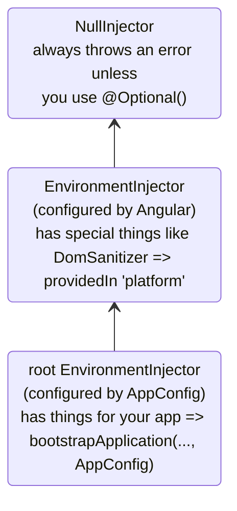
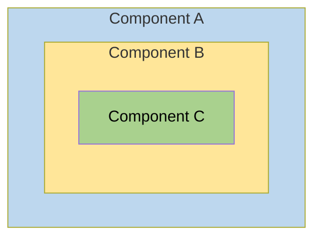
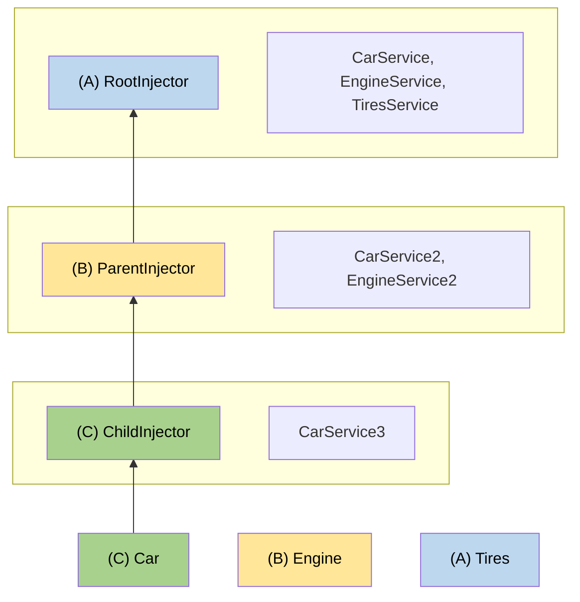

# 階層型インジェクター

このガイドでは、解決ルール、修飾子、および高度なパターンを含む、Angularの階層的な依存性の注入システムについて詳しく説明します。

NOTE: インジェクター階層とプロバイダースコープに関する基本概念については、[依存性プロバイダーの定義ガイド](guide/di/defining-dependency-providers#injector-hierarchy-in-angular)を参照してください。

## インジェクター階層のタイプ {#types-of-injector-hierarchies}

Angularには、次の2つのインジェクター階層があります。

| インジェクター階層            | 詳細                                                                                                                                                             |
| :--------------------------- | :-------------------------------------------------------------------------------------------------------------------------------------------------------------- |
| `EnvironmentInjector` 階層   | `@Injectable()` または `ApplicationConfig` の `providers` 配列を使用して、この階層で `EnvironmentInjector` を構成します。                                            |
| `ElementInjector` 階層       | 各 DOM 要素で暗黙的に作成されます。 `ElementInjector` は、 `@Directive()` または `@Component()` の `providers` プロパティで構成しない限り、デフォルトでは空です。 |

<docs-callout title="NgModule ベースのアプリケーション">
`NgModule` ベースのアプリケーションの場合、`@NgModule()` または `@Injectable()` アノテーションを使用して、`ModuleInjector` 階層で依存関係を提供できます。
</docs-callout>

### `EnvironmentInjector`

`EnvironmentInjector` は、次のいずれかの方法で構成できます。

- `@Injectable()` の `providedIn` プロパティを使用して `root` または `platform` を参照する
- `ApplicationConfig` の `providers` 配列を使用する

<docs-callout title="ツリーシェイクと @Injectable()">

`@Injectable()` の `providedIn` プロパティを使用することは、 `ApplicationConfig` の `providers` 配列を使用するよりも好ましいです。 `@Injectable()` の `providedIn` を使用すると、最適化ツールはツリーシェイクを実行して、アプリケーションで使用されていないサービスを削除できます。これにより、バンドルサイズが小さくなります。

ツリーシェイクは、特にライブラリにとって有用です。なぜなら、ライブラリを使用するアプリケーションは、ライブラリを注入する必要がない場合があるからです。

</docs-callout>

`EnvironmentInjector` は、 `ApplicationConfig.providers` によって構成されます。

`providedIn` を使用して、次のように `@Injectable()` を使用してサービスを提供します。

```ts {highlight:[4]}
import {Injectable} from '@angular/core';

@Injectable({
  providedIn: 'root', // <--ルート EnvironmentInjector でこのサービスを提供します
})
export class ItemService {
  name = 'telephone';
}
```

`@Injectable()` デコレーターは、サービスクラスを識別します。
`providedIn` プロパティは、特定の `EnvironmentInjector`（ここでは `root`）を構成します。これにより、サービスは `root` `EnvironmentInjector` で使用可能になります。

### ModuleInjector

`NgModule` ベースのアプリケーションの場合、`ModuleInjector` は、次のいずれかの方法で構成できます。

- `@Injectable()` の `providedIn` プロパティを使用して `root` または `platform` を参照する
- `@NgModule()` の `providers` 配列を使用する

`ModuleInjector` は、 `@NgModule.providers` および `NgModule.imports` プロパティによって構成されます。 `ModuleInjector` は、 `NgModule.imports` を再帰的にたどることによって到達できるすべてのプロバイダー配列をフラット化したものです。

子 `ModuleInjector` 階層は、他の `@NgModules` を遅延読み込みするときに作成されます。

### プラットフォームインジェクター {#platform-injector}

`root` の上にさらに2つのインジェクター、追加の `EnvironmentInjector` と `NullInjector()` があります。

Angularが `main.ts` の次の内容でアプリケーションをブートストラップする方法を検討してください。

```ts
bootstrapApplication(App, appConfig);
```

`bootstrapApplication()` メソッドは、 `ApplicationConfig` インスタンスによって構成されたプラットフォームインジェクターの子インジェクターを作成します。
これが `root` `EnvironmentInjector` です。

`platformBrowserDynamic()` メソッドは、プラットフォーム固有の依存関係を含む `PlatformModule` によって構成されたインジェクターを作成します。
これにより、複数のアプリケーションがプラットフォーム構成を共有できます。
たとえば、ブラウザには、実行中のアプリケーションの数にかかわらず、URLバーは1つだけです。
`platformBrowser()` 関数を使用して `extraProviders` を提供することにより、プラットフォームレベルで追加のプラットフォーム固有のプロバイダーを構成できます。

階層の次の親インジェクターは `NullInjector()` で、ツリーのトップです。
ツリーをそこまで上に移動して `NullInjector()` 内でサービスを検索した場合、 `@Optional()` を使用していない限り、エラーが発生します。最終的にはすべて `NullInjector()` で終了し、エラーを返すか、 `@Optional()` の場合、 `null` を返します。
`@Optional()` の詳細については、このガイドの [`@Optional()` セクション](#optional) を参照してください。

次の図は、前の段落で説明したように、 `root` `ModuleInjector` とその親インジェクターの関係を表しています。



`root` という名前は特別なエイリアスですが、他の `EnvironmentInjector` 階層にはエイリアスがありません。
動的にロードされたコンポーネントが作成されるたびに `EnvironmentInjector` 階層を作成するオプションがあります。たとえば、ルーターを使用すると、子 `EnvironmentInjector` 階層が作成されます。

`ApplicationConfig` インスタンスを `bootstrapApplication()` メソッドに渡して構成するか、 `root` で独自のサービスにすべてのプロバイダーを登録したかにかかわらず、すべての要求はルートインジェクターに転送されます。

<docs-callout title="@Injectable() vs. ApplicationConfig">

`bootstrapApplication()` の `ApplicationConfig` でアプリケーション全体のプロバイダーを構成すると、 `@Injectable()` メタデータの `root` で構成されたプロバイダーがオーバーライドされます。
これは、複数のアプリケーションで共有されるサービスのデフォルト以外のプロバイダーを構成する場合に行うことができます。

コンポーネントルーターの構成にデフォルト以外の [ロケーション戦略](guide/routing/common-router-tasks#locationstrategy-and-browser-url-styles) が含まれている場合、 `ApplicationConfig` の `providers` リストにそのプロバイダーをリストすることによって、その例を示します。

```ts
providers: [{provide: LocationStrategy, useClass: HashLocationStrategy}];
```

`NgModule` ベースのアプリケーションの場合、アプリケーション全体のプロバイダーを `AppModule` の `providers` で構成します。

</docs-callout>

### `ElementInjector`

Angularは、各DOM要素に対して `ElementInjector` 階層を暗黙的に作成します。

`@Component()` デコレーターの `providers` または `viewProviders` プロパティを使用してサービスを提供すると、 `ElementInjector` が構成されます。
たとえば、次の `TestComponent` は、次のようにサービスを提供することで `ElementInjector` を構成します。

```ts {highlight:[3]}
@Component({
  /* … */
  providers: [{ provide: ItemService, useValue: { name: 'lamp' } }]
})
export class TestComponent
```

HELPFUL: [解決ルール](#resolution-rules) セクションを参照して、 `EnvironmentInjector` ツリー、 `ModuleInjector`、および `ElementInjector` ツリーの関係を理解してください。

コンポーネントでサービスを提供すると、そのサービスは、そのコンポーネントインスタンスの `ElementInjector` を介して使用可能になります。
[解決ルール](#resolution-rules) セクションで説明されている可視性ルールに基づいて、子コンポーネント/ディレクティブでも可視化される可能性があります。

コンポーネントインスタンスが破棄されると、そのサービスインスタンスも破棄されます。

#### `@Directive()` と `@Component()`

コンポーネントは特殊なタイプのディレクティブであるため、 `@Directive()` に `providers` プロパティがあるように、 `@Component()` にも `providers` プロパティがあります。
つまり、ディレクティブとコンポーネントは、 `providers` プロパティを使用してプロバイダーを構成できます。
`providers` プロパティを使用してコンポーネントまたはディレクティブのプロバイダーを構成すると、そのプロバイダーはそのコンポーネントまたはディレクティブの `ElementInjector` に属します。
同じ要素上のコンポーネントとディレクティブは、インジェクターを共有します。

## 解決ルール {#resolution-rules}

コンポーネント/ディレクティブのトークンを解決する場合、Angularは次の2つのフェーズで解決します。

1. `ElementInjector` 階層の親に対して。
2. `EnvironmentInjector` 階層の親に対して。

コンポーネントが依存関係を宣言すると、Angularはその依存関係を自身の `ElementInjector` で満たそうとします。
コンポーネントのインジェクターにプロバイダーがない場合、そのリクエストを親コンポーネントの `ElementInjector` に渡します。

リクエストは、Angularがリクエストを処理できるインジェクターを見つけるか、祖先 `ElementInjector` 階層を使い果たすまで、転送され続けます。

Angularがいずれの `ElementInjector` 階層でもプロバイダーを見つけられない場合、リクエストが発生した要素に戻り、 `EnvironmentInjector` 階層を調べます。
それでもAngularがプロバイダーを見つけられない場合、エラーをスローします。

同じDIトークンのプロバイダーを異なるレベルで登録した場合、Angularが最初に遭遇するプロバイダーが、依存関係を解決するために使用するプロバイダーです。
たとえば、サービスを必要とするコンポーネントにプロバイダーがローカルに登録されている場合、
Angularは同じサービスの別のプロバイダーを探しません。

HELPFUL: `NgModule` ベースのアプリケーションの場合、Angularは `ElementInjector` 階層でプロバイダーが見つからない場合、 `ModuleInjector` 階層を検索します。

## 解決修飾子 {#resolution-modifiers}

Angularの解決動作は、`optional`、`self`、`skipSelf`、および `host` を使用して変更できます。
`@angular/core` からそれぞれをインポートし、サービスを注入するときに [`inject`](/api/core/inject) 構成でそれぞれを使用します。

### 修飾子の種類 {#types-of-modifiers}

解決修飾子は、次の3つのカテゴリーに分類されます。

- Angularが探しているものを見つけられない場合にどうするか、つまり `optional`
- どこから探し始めるか、つまり `skipSelf`
- どこで探すのをやめるか、`host` および `self`

デフォルトでは、Angularは常に現在の `Injector` から始めて、すべてを上に検索し続けます。
修飾子を使用すると、開始位置（または _self_ 位置）と終了位置を変更できます。

さらに、次の修飾子を除いて、すべての修飾子を組み合わせることができます。

- `host` と `self`
- `skipSelf` と `self`

### `optional`

`optional` を使用すると、Angularは注入するサービスをオプションと見なすことができます。
そのため、実行時に解決できない場合、Angularはサービスをエラーをスローするのではなく、 `null` として解決します。
次の例では、サービス `OptionalService` はサービス `ApplicationConfig`や`@NgModule()`、コンポーネントクラスで提供されていないため、アプリケーションのどこにも使用できません。

```ts {header:"src/app/optional/optional.ts"}
export class Optional {
  public optional? = inject(OptionalService, {optional: true});
}
```

### `self`

`self` を使用すると、Angularは現在のコンポーネントまたはディレクティブの `ElementInjector` のみを調べます。

`self` の適切なユースケースは、サービスを注入するが、現在のホスト要素で使用可能な場合のみにすることです。
このような状況でエラーを回避するには、`self` を `optional` と組み合わせます。

たとえば、次の `SelfNoData` では、プロパティとして注入された `LeafService` に注目してください。

```ts {header: 'self-no-data.ts', highlight: [7]}
@Component({
  selector: 'app-self-no-data',
  templateUrl: './self-no-data.html',
  styleUrls: ['./self-no-data.css'],
})
export class SelfNoData {
  public leaf = inject(LeafService, {optional: true, self: true});
}
```

この例では、親プロバイダーがあり、サービスを注入すると値が返されますが、`self` と `optional` を使用してサービスを注入すると `null` が返されます。これは、`self` がインジェクターに現在のホスト要素で検索を停止するよう指示するためです。

別の例では、 `FlowerService` のプロバイダーを備えたコンポーネントクラスを示しています。
この場合、インジェクターは現在の `ElementInjector` より先を見ずに、 `FlowerService` を見つけて、チューリップ 🌷 を返します。

```ts {header:"src/app/self/self.ts"}
@Component({
  selector: 'app-self',
  templateUrl: './self.html',
  styleUrls: ['./self.css'],
  providers: [{provide: FlowerService, useValue: {emoji: '🌷'}}],
})
export class Self {
  constructor(@Self() public flower: FlowerService) {}
}
```

### `skipSelf`

`skipSelf` は `self` の反対です。
`skipSelf` を使用すると、Angularは現在の `ElementInjector` ではなく、親 `ElementInjector` でサービスの検索を開始します。
そのため、親`ElementInjector`が`emoji`にシダ<code>🌿</code>値を使用していたが、コンポーネントの`providers`配列にカエデの葉<code>🍁</code>が含まれている場合、Angularはカエデの葉<code>🍁</code>を無視して、シダ<code>🌿</code>を使用します。

これをコードで確認するために、親コンポーネントが使用する `emoji` の次の値を想定します。これは、このサービスと同じです。

```ts {header: 'leaf.service.ts'}
export class LeafService {
  emoji = '🌿';
}
```

子コンポーネントに、異なる値、カエデの葉 🍁 が含まれていると想像してください。ただし、親の値を使用したいとします。
これが `skipSelf` を使用する場合です。

```ts {header:"skipself.ts" highlight:[[6],[10]]}
@Component({
  selector: 'app-skipself',
  templateUrl: './skipself.html',
  styleUrls: ['./skipself.css'],
  // Angular はこの LeafService インスタンスを無視します
  providers: [{provide: LeafService, useValue: {emoji: '🍁'}}],
})
export class Skipself {
  // Use skipSelf as inject option
  public leaf = inject(LeafService, {skipSelf: true});
}
```

この場合、 `emoji` に対して取得する値は、カエデの葉 <code>🍁</code> ではなく、シダ <code>🌿</code> になります。

#### `skipSelf` オプションと `optional` {#skipself-option-with-optional}

値が `null` の場合にエラーを防ぐために、`skipSelf` オプションを `optional` と一緒に使用します。

次の例では、 `Person` サービスはプロパティの初期化中に注入されます。
`skipSelf` はAngularに現在のインジェクターをスキップするよう指示し、`optional` は `Person` サービスが `null` の場合にエラーを防ぎます。

```ts
class Person {
  parent = inject(Person, {optional: true, skipSelf: true});
}
```

### `host`

<!-- TODO: Remove ambiguity between host and self. -->

`host` を使用すると、プロバイダーを検索するときに、コンポーネントをインジェクターツリーの最後の停止点として指定できます。

ツリーのさらに上にサービスインスタンスがある場合でも、Angularは検索を続けません。
`host` を次のように使用します。

```ts {header:"host.ts" highlight:[[6],[9]]}
@Component({
  selector: 'app-host',
  templateUrl: './host.html',
  styleUrls: ['./host.css'],
  // provide the service
  providers: [{provide: FlowerService, useValue: {emoji: '🌷'}}],
})
export class Host {
  // use host when injecting the service
  flower = inject(FlowerService, {host: true, optional: true});
}
```

`Host`に`host`オプションがあるため、`Host`の親が`flower.emoji`にどのような値を持っていても、`Host`はチューリップ<code>🌷</code>を使用します。

### コンストラクター注入での修飾子 {#modifiers-with-constructor-injection}

前に示したように、コンストラクター注入の動作は、`@Optional()`、`@Self()`、`@SkipSelf()`、および `@Host()` を使用して変更できます。

`@angular/core` からそれぞれをインポートし、サービスを注入するときにコンポーネントクラスのコンストラクターでそれぞれを使用します。

```ts {header:"self-no-data.ts" highlight:[2]}
export class SelfNoData {
  constructor(@Self() @Optional() public leaf?: LeafService) {}
}
```

## テンプレートの論理構造 {#logical-structure-of-the-template}

コンポーネントクラスでサービスを提供する場合、サービスは、サービスの提供場所と方法に応じて、 `ElementInjector` ツリー内で可視になります。

Angularテンプレートの基になる論理構造を理解すると、サービスの構成と、その可視性の制御のための基礎が得られます。

コンポーネントは、次の例のようにテンプレートで使用されます。

```html
<app-root> <app-child />; </app-root>
```

HELPFUL: 通常、コンポーネントとそのテンプレートは別々のファイルに宣言します。
注入システムの動作を理解するために、それらを組み合わせた論理ツリーの視点から見ると便利です。
用語 _論理_ は、アプリケーションのDOMツリーであるレンダリングツリーと区別しています。
コンポーネントテンプレートの場所を示すために、このガイドでは `<#VIEW>` 疑似要素を使用します。この疑似要素は、レンダリングツリーには実際に存在せず、メンタルモデルの目的でのみ存在します。

以下は、 `<app-root>` と `<app-child>` のビューツリーを1つの論理ツリーに結合した例です。

```html
<app-root>
  <#VIEW>
    <app-child>
     <#VIEW>
       …content goes here…
     </#VIEW>
    </app-child>
  </#VIEW>
</app-root>
```

`<#VIEW>` の区切りの考え方を理解することは、特にコンポーネントクラスでサービスを構成する場合に重要です。

## 例： `@Component()` でサービスを提供する {#example-providing-services-in-component}

`@Component()`（または `@Directive()`）デコレーターを使用してサービスを提供する方法は、サービスの可視性を決めます。
次のセクションでは、`providers` と `viewProviders` について、および `skipSelf` と `host` を使用してサービスの可視性を変更する方法を説明します。

コンポーネントクラスでは、次の2つの方法でサービスを提供できます。

| 配列                         | 詳細                                           |
| :--------------------------- | :--------------------------------------------- |
| `providers` 配列を使用する     | `@Component({ providers: [SomeService] })`     |
| `viewProviders` 配列を使用する | `@Component({ viewProviders: [SomeService] })` |

次の例では、Angularアプリケーションの論理ツリーが表示されます。
テンプレートのコンテキストでインジェクターがどのように動作するかを示すために、論理ツリーはアプリケーションのHTML構造を表します。
たとえば、論理ツリーは、 `<child-component>` が `<parent-component>` の直接の子であることを示します。

論理ツリーでは、 `@Provide` 、 `@Inject` 、および `@ApplicationConfig` という特殊な属性が表示されます。
これらは実際の属性ではなく、内部で何が起こっているかを説明するためにここにあります。

| Angular サービス属性      | 詳細                                                                                   |
| :----------------------- | :------------------------------------------------------------------------------------- |
| `@Inject(Token)=>Value`  | 論理ツリーのこの場所に `Token` が注入されている場合、その値は `Value` になります。        |
| `@Provide(Token=Value)`  | 論理ツリーのこの場所に `Token` が `Value` で提供されていることを示します。              |
| `@ApplicationConfig`     | この場所でフォールバック `EnvironmentInjector` を使用する必要があることを示します。     |

### アプリケーション構造の例 {#example-app-structure}

この例では、 `emoji` の値が赤いハイビスカス <code>🌺</code> である、 `root` に提供される `FlowerService` があります。

```ts {header:"lower.service.ts"}
@Injectable({
  providedIn: 'root',
})
export class FlowerService {
  emoji = '🌺';
}
```

`App` と `Child` のみが含まれるアプリケーションを検討してください。
最も基本的なレンダリングされたビューは、次のようなネストされたHTML要素のように見えます。

```html
<app-root>
  <!-- App selector -->
  <app-child> <!-- Child selector --> </app-child>
</app-root>
```

ただし、裏側では、Angularはインジェクションリクエストを解決するときに、次のような論理ビュー表現を使用します。

```html
<app-root> <!-- App selector -->
  <#VIEW>
    <app-child> <!-- Child selector -->
      <#VIEW>
      </#VIEW>
    </app-child>
  </#VIEW>
</app-root>
```

ここでの `<#VIEW>` は、テンプレートのインスタンスを表しています。
各コンポーネントには、独自の `<#VIEW>` があることに注意してください。

この構造を理解することで、サービスの提供方法と注入方法を把握し、サービスの可視性を完全に制御できます。

次に、 `<app-root>` が `FlowerService` を注入しているとします。

```typescript
export class App {
  flower = inject(FlowerService);
}
```

結果を視覚化するために、 `<app-root>` テンプレートにバインディングを追加します。

```html
<p>Emoji from FlowerService: {{flower.emoji}}</p>
```

ビューに出力されるのは次のとおりです。

```text {hideCopy}
Emoji from FlowerService: 🌺
```

論理ツリーでは、これは次のように表されます。

```html
<app-root @ApplicationConfig
        @Inject(FlowerService) flower=>"🌺">
  <#VIEW>
    <p>Emoji from FlowerService: {{flower.emoji}} (🌺)</p>
    <app-child>
      <#VIEW>
      </#VIEW>
    </app-child>
  </#VIEW>
</app-root>
```

`<app-root>` が `FlowerService` を要求すると、インジェクターは `FlowerService` トークンを解決します。
トークンの解決は次の2つのフェーズで行われます。

1. インジェクターは、論理ツリー内の開始位置と検索の終了位置を決定します。
   インジェクターは開始位置から始めて、論理ツリーの各ビューレベルでトークンを検索します。
   トークンが見つかると、そのトークンが返されます。

1. トークンが見つからない場合、インジェクターはリクエストを委任する最も近い親 `EnvironmentInjector` を検索します。

この例の場合、制約は次のとおりです。

1. `<app-root>` に属する `<#VIEW>` から始めて、 `<app-root>` で終了します。
   - 通常、検索の開始点は注入ポイントです。
     ただし、この場合、 `<app-root>` はコンポーネントです。 `@Component` は特殊で、独自の `viewProviders` も含まれています。そのため、検索は `<app-root>` に属する `<#VIEW>` から開始されます。
     これは、同じ場所に一致するディレクティブでは発生しません。
   - 終了位置は、コンポーネント自体と同じになります。なぜなら、これはこのアプリケーションの最上位コンポーネントだからです。

1. `ApplicationConfig` によって提供される `EnvironmentInjector` は、インジェクショントークンが `ElementInjector` 階層で見つからない場合のフォールバックインジェクターとして機能します。

### `providers` 配列を使用する {#using-the-providers-array}

次に、 `Child` クラスで、今後のセクションでより複雑な解決ルールを説明するために、 `FlowerService` のプロバイダーを追加します。

```ts
@Component({
  selector: 'app-child',
  templateUrl: './child.html',
  styleUrls: ['./child.css'],
  // use the providers array to provide a service
  providers: [{provide: FlowerService, useValue: {emoji: '🌻'}}],
})
export class Child {
  // inject the service
  flower = inject(FlowerService);
}
```

`FlowerService` が `@Component()` デコレーターで提供されるようになったため、 `<app-child>` がサービスを要求すると、インジェクターは `<app-child>` の `ElementInjector` ほど遠くまでしか見なくてもよくなります。
インジェクターは、インジェクターツリーをさらに検索する必要はありません。

次のステップは、 `Child` テンプレートにバインディングを追加することです。

```html
<p>Emoji from FlowerService: {{flower.emoji}}</p>
```

新しい値をレンダリングするために、ビューにひまわりも表示されるように、 `App` テンプレートの下部に `<app-child>` を追加します。

```text {hideCopy}
Child Component
Emoji from FlowerService: 🌻
```

論理ツリーでは、これは次のように表されます。

```html
<app-root @ApplicationConfig
          @Inject(FlowerService) flower=>"🌺">
  <#VIEW>

  <p>Emoji from FlowerService: {{flower.emoji}} (🌺)</p>
  <app-child @Provide(FlowerService="🌻" )
             @Inject(FlowerService)=>"🌻"> <!-- search ends here -->
    <#VIEW> <!-- search starts here -->
    <h2>Child Component</h2>
    <p>Emoji from FlowerService: {{flower.emoji}} (🌻)</p>
  </
  #VIEW>
  </app-child>
</#VIEW>
</app-root>
```

`<app-child>` が `FlowerService` を要求すると、インジェクターは `<app-child>` に属する `<#VIEW>`（`@Component()` から注入されるため `<#VIEW>` が含まれています）から始めて、 `<app-child>` で終了します。
この場合、 `FlowerService` は、 `<app-child>` の `providers` 配列で、ひまわり <code>🌻</code> を使用して解決されます。
インジェクターは、インジェクターツリーをさらに検索する必要はありません。
`FlowerService` を見つけるとすぐに停止し、赤いハイビスカス <code>🌺</code> は見えません。

### `viewProviders` 配列を使用する {#using-the-viewproviders-array}

`viewProviders` 配列は、 `@Component()` デコレーターでサービスを提供する別の方法です。
`viewProviders` を使用すると、サービスは `<#VIEW>` で可視になります。

HELPFUL: ステップは `providers` 配列を使用する場合と同じですが、 `viewProviders` 配列を使用する点が異なります。

ステップバイステップの手順については、このセクションを続行してください。
自分で設定できる場合は、[サービスの可用性を変更する](#visibility-of-provided-tokens) に進んでください。

デモのために、 `AnimalService` を作成して、 `viewProviders` を示します。
最初に、 `emoji` プロパティがクジラ <code>🐳</code> である `AnimalService` を作成します。

```typescript
import {Injectable} from '@angular/core';

@Injectable({
  providedIn: 'root',
})
export class AnimalService {
  emoji = '🐳';
}
```

`FlowerService` と同じパターンに従って、 `App` クラスに `AnimalService` を注入します。

```ts
export class App {
  public flower = inject(FlowerService);
  public animal = inject(AnimalService);
}
```

HELPFUL: `FlowerService` に関連するコードはすべてそのままにしておくことができます。これにより、 `AnimalService` との比較が可能になります。

`viewProviders` 配列を追加し、 `<app-child>` クラスにも `AnimalService` を注入しますが、 `emoji` に異なる値を与えます。
ここでは、犬 🐶 の値があります。

```typescript
@Component({
  selector: 'app-child',
  templateUrl: './child.html',
  styleUrls: ['./child.css'],
  // provide services
  providers: [{provide: FlowerService, useValue: {emoji: '🌻'}}],
  viewProviders: [{provide: AnimalService, useValue: {emoji: '🐶'}}],
})
export class Child {
  // inject services
  flower = inject(FlowerService);
  animal = inject(AnimalService);
}
```

`Child` と `App` のテンプレートにバインディングを追加します。
`Child` テンプレートに、次のバインディングを追加します。

```html
<p>Emoji from AnimalService: {{animal.emoji}}</p>
```

さらに、 `App` テンプレートにも同じものを追加します。

```html
<p>Emoji from AnimalService: {{animal.emoji}}</p>
```

これで、ブラウザに両方の値が表示されます。

```text {hideCopy}
App
Emoji from AnimalService: 🐳

Child Component
Emoji from AnimalService: 🐶
```

この `viewProviders` の例の論理ツリーは次のとおりです。

```html
<app-root @ApplicationConfig
          @Inject(AnimalService) animal=>"🐳">
  <#VIEW>
  <app-child>
    <#VIEW @Provide(AnimalService="🐶")
    @Inject(AnimalService=>"🐶")>

    <!-- ^^using viewProviders means AnimalService is available in <#VIEW>-->
    <p>Emoji from AnimalService: {{animal.emoji}} (🐶)</p>
  </
  #VIEW>
  </app-child>
</#VIEW>
</app-root>
```

`FlowerService` の例と同様に、 `AnimalService` は `<app-child>` の `@Component()` デコレーターで提供されています。
つまり、インジェクターは最初にコンポーネントの `ElementInjector` を調べるため、犬 <code>🐶</code> の `AnimalService` 値が見つかります。
インジェクターは、 `ElementInjector` ツリーをさらに検索する必要も、 `ModuleInjector` を検索する必要もありません。

### `providers` と `viewProviders` の違い {#providers-vs-viewproviders}

`viewProviders` フィールドは、概念的には `providers` と似ていますが、1つの顕著な違いがあります。
`viewProviders` で構成されたプロバイダーは、コンポーネントの論理的な子になる投影されたコンテンツには可視ではありません。

`providers` と `viewProviders` の違いを確認するために、別のコンポーネントを例に追加して、 `Inspector` と呼びます。
`Inspector` は、 `Child` の子になります。
`inspector.ts` では、プロパティの初期化中に `FlowerService` と `AnimalService` を注入します。

```typescript
export class Inspector {
  flower = inject(FlowerService);
  animal = inject(AnimalService);
}
```

`providers` または `viewProviders` 配列は必要ありません。
次に、 `inspector.html` に、以前のコンポーネントと同じマークアップを追加します。

```html
<p>Emoji from FlowerService: {{flower.emoji}}</p>
<p>Emoji from AnimalService: {{animal.emoji}}</p>
```

`Inspector` を `Child` の `imports` 配列に追加することを忘れないでください。

```ts
@Component({
  ...
  imports: [Inspector]
})
```

次に、 `child.html` に次を追加します。

```html
...

<div class="container">
  <h3>Content projection</h3>
  <ng-content />
</div>
<h3>Inside the view</h3>

<app-inspector />
```

`<ng-content>` を使用するとコンテンツを投影でき、 `Child` テンプレート内の `<app-inspector>` は、 `Inspector` を `Child` の子コンポーネントにします。

次に、コンテンツ投影を活用するために、 `app.html` に次を追加します。

```html
<app-child>
  <app-inspector />
</app-child>
```

これで、ブラウザには、以前の例は省略して、次のものがレンダリングされます。

```text {hideCopy}
...
Content projection

Emoji from FlowerService: 🌻
Emoji from AnimalService: 🐳

Emoji from FlowerService: 🌻
Emoji from AnimalService: 🐶
```

これらの4つのバインディングは、 `providers` と `viewProviders` の違いを示しています。
犬の絵文字 <code>🐶</code> は、 `Child` の `<#VIEW>` 内に宣言され、投影されたコンテンツには可視ではないことを覚えておいてください。
代わりに、投影されたコンテンツには、クジラ <code>🐳</code> が表示されます。

ただし、次の出力セクションでは `Inspector` は `Child` の実際の子コンポーネントです。そして `Inspector` は `<#VIEW>` の内側にあるため、 `AnimalService` を要求すると、犬 <code>🐶</code> が表示されます。

論理ツリー内の `AnimalService` は、次のようになります。

```html
<app-root @ApplicationConfig
          @Inject(AnimalService) animal=>"🐳">
  <#VIEW>
  <app-child>
    <#VIEW @Provide(AnimalService="🐶")
    @Inject(AnimalService=>"🐶")>

    <!-- ^^using viewProviders means AnimalService is available in <#VIEW>-->
    <p>Emoji from AnimalService: {{animal.emoji}} (🐶)</p>

    <div class="container">
      <h3>Content projection</h3>
      <app-inspector @Inject(AnimalService) animal=>"🐳">
        <p>Emoji from AnimalService: {{animal.emoji}} (🐳)</p>
      </app-inspector>
    </div>

    <app-inspector>
      <#VIEW @Inject(AnimalService) animal=>"🐶">
      <p>Emoji from AnimalService: {{animal.emoji}} (🐶)</p>
    </
    #VIEW>
    </app-inspector>
  </
  #VIEW>
  </app-child>

</#VIEW>
</app-root>
```

`<app-inspector>` の投影されたコンテンツには、クジラ <code>🐳</code> が表示され、犬 <code>🐶</code> は表示されません。これは、犬 <code>🐶</code> が `<app-child>` の `<#VIEW>` の内側にあるためです。
`<app-inspector>` は、 `<#VIEW>` の内側にある場合にのみ、犬 <code>🐶</code> を表示できます。

### 提供されたトークンの可視性 {#visibility-of-provided-tokens}

可視性デコレーターは、論理ツリー内でインジェクショントークンの検索を開始する場所と終了する場所を制御します。
これを行うには、宣言のポイントではなく、注入のポイント、つまり `inject()` を呼び出すときに可視性構成を配置します。

インジェクターが `FlowerService` の検索を開始する場所を変更するには、`FlowerService` が注入される `<app-child>` の `inject()` 呼び出しに `skipSelf` を追加します。
この呼び出しは、`child.ts` に示すように、`<app-child>` のプロパティ初期化子です。

```typescript
flower = inject(FlowerService, {skipSelf: true});
```

`skipSelf` を使用すると、`<app-child>` インジェクターは `FlowerService` を自分自身で探しません。
代わりに、インジェクターは `<app-root>` の `ElementInjector` で `FlowerService` の検索を開始し、何も見つかりません。
次に、 `<app-child>` の `ModuleInjector` に戻り、 `<app-child>` と `<app-root>` が同じ `ModuleInjector` を共有しているため、赤いハイビスカス <code>🌺</code> 値が見つかります。
UIには次のように表示されます。

```text {hideCopy}
Emoji from FlowerService: 🌺
```

論理ツリーでは、この同じ考え方は次のようになります。

```html
<app-root @ApplicationConfig
          @Inject(FlowerService) flower=>"🌺">
  <#VIEW>
  <app-child @Provide(FlowerService="🌻" )>
    <#VIEW @Inject(FlowerService, SkipSelf)=>"🌺">

    <!-- With SkipSelf, the injector looks to the next injector up the tree (app-root) -->

  </
  #VIEW>
  </app-child>
</#VIEW>
</app-root>
```

`<app-child>`がひまわり<code>🌻</code>を提供しているにもかかわらず、アプリケーションは赤いハイビスカス<code>🌺</code>をレンダリングします。これは、`skipSelf`が現在のインジェクター（`app-child`）に自身をスキップして親を探すよう指示するためです。

今度、（`skipSelf`に加えて）`host`を追加すると、結果は`null`になります。
これは、`host`が検索の上限を`app-child`の`<#VIEW>`に制限するためです。
論理ツリーでの考え方は次のとおりです。

```html
<app-root @ApplicationConfig
          @Inject(FlowerService) flower=>"🌺">
  <#VIEW> <!-- end search here with null-->
  <app-child @Provide(FlowerService="🌻" )> <!-- start search here -->
    <#VIEW inject(FlowerService, {skipSelf: true, host: true, optional:true})=>null>
  </
  #VIEW>
  </app-parent>
</#VIEW>
</app-root>
```

ここでは、サービスとその値は同じですが、`host` はインジェクターが `<#VIEW>` より先を `FlowerService` について探すのを止めるため、見つからずに `null` を返します。

### `skipSelf` と `viewProviders` {#skipself-and-viewproviders}

覚えておいてください。 `<app-child>` は、 `viewProviders` 配列で `AnimalService` を提供し、その値は犬 <code>🐶</code> です。
インジェクターは、 `<app-child>` の `ElementInjector` を `AnimalService` について調べるだけなので、クジラ <code>🐳</code> は見えません。

`FlowerService` の例と同様に、`AnimalService` の `inject()` に `skipSelf` を追加すると、インジェクターは現在の `<app-child>` の `ElementInjector` で `AnimalService` を探しません。
代わりに、インジェクターは `<app-root>` の `ElementInjector` で検索を開始します。

```typescript
@Component({
  selector: 'app-child',
  …
  viewProviders: [
    { provide: AnimalService, useValue: { emoji: '🐶' } },
  ],
})
```

論理ツリーは、`<app-child>` で `skipSelf` を使用すると次のようになります。

```html
<app-root @ApplicationConfig
          @Inject(AnimalService=>"🐳")>
  <#VIEW><!-- search begins here -->
  <app-child>
    <#VIEW @Provide(AnimalService="🐶")
    @Inject(AnimalService, SkipSelf=>"🐳")>

    <!--Add skipSelf -->

  </
  #VIEW>
  </app-child>
</#VIEW>
</app-root>
```

`<app-child>`で`skipSelf`を使用すると、インジェクターは`<app-root>`の`ElementInjector`で`AnimalService`の検索を開始し、クジラ🐳を見つけます。

### `host` と `viewProviders` {#host-and-viewproviders}

`AnimalService`のインジェクションに`host`だけを使用する場合、インジェクターは`<app-child>`の`<#VIEW>`自体で`AnimalService`を見つけるため、結果は犬<code>🐶</code>になります。
`Child`は`viewProviders`を設定し、犬の絵文字が`AnimalService`の値として提供されます。
`inject()`では`host`も使用できます：

```typescript
@Component({
  selector: 'app-child',
  …
  viewProviders: [
    { provide: AnimalService, useValue: { emoji: '🐶' } },
  ]
})
export class Child {
  animal = inject(AnimalService, { host: true })
}
```

`host: true` はインジェクターに `<#VIEW>` の端に遭遇するまで探すよう指示します。

```html
<app-root @ApplicationConfig
          @Inject(AnimalService=>"🐳")>
  <#VIEW>
  <app-child>
    <#VIEW @Provide(AnimalService="🐶")
    inject(AnimalService, {host: true}=>"🐶")> <!-- host stops search here -->
  </
  #VIEW>
  </app-child>
</#VIEW>
</app-root>
```

3番目の動物、ハリネズミ <code>🦔</code> を含む `viewProviders` 配列を、 `app.component.ts` の `@Component()` メタデータに追加します。

```typescript
@Component({
  selector: 'app-root',
  templateUrl: './app.html',
  styleUrls: [ './app.css' ],
  viewProviders: [
    { provide: AnimalService, useValue: { emoji: '🦔' } },
  ],
})
```

次に、`child.ts` の `AnimalService` 注入の `inject()` に `host` とともに `skipSelf` を追加します。
`animal` プロパティの初期化における `host` と `skipSelf` は次のとおりです。

```typescript
export class Child {
  animal = inject(AnimalService, {host: true, skipSelf: true});
}
```

<!-- TODO: This requires a rework. It seems not well explained what `viewProviders`/`injectors` is here
  and how `host` works.
 -->

`providers` 配列にある `FlowerService` に `host` と `skipSelf` を適用した場合、結果は `null` でした。これは、`skipSelf` が `<app-child>` インジェクターで検索を開始しますが、`host` は `<#VIEW>` で検索を停止するためです。そこには `FlowerService` がありません。
論理ツリーでは、 `FlowerService` は `<app-child>` で可視であり、 `<#VIEW>` では可視ではないことがわかります。

ただし、 `App` の `viewProviders` 配列で提供されている `AnimalService` は可視です。

論理ツリーの表現は、これが理由を示しています。

```html
<app-root @ApplicationConfig
          @Inject(AnimalService=>"🐳")>
  <#VIEW @Provide(AnimalService="🦔")
  @Inject(AnimalService, @Optional)=>"🦔">

  <!-- ^^skipSelf starts here,  host stops here^^ -->
  <app-child>
    <#VIEW @Provide(AnimalService="🐶")
    inject(AnimalService, {skipSelf:true, host: true, optional: true})=>"🦔">
    <!-- Add skipSelf ^^-->
  </
  #VIEW>
  </app-child>
</#VIEW>
</app-root>
```

`skipSelf` は、インジェクターがリクエストが発生した `<app-child>` ではなく `<app-root>` で `AnimalService` の検索を開始し、`host` は `<app-root>` の `<#VIEW>` で検索を停止します。
`AnimalService` は `viewProviders` 配列を介して提供されるため、インジェクターは `<#VIEW>` でハリネズミ <code>🦔</code> を見つけます。

## 例： `ElementInjector` のユースケース {#example-elementinjector-use-cases}

さまざまなレベルで1つ以上のプロバイダーを構成する機能により、便利な可能性が開かれます。

### シナリオ：サービスの分離 {#scenario-service-isolation}

アーキテクチャ上の理由から、サービスへのアクセスを属するアプリケーションドメインに制限する必要がある場合があります。
たとえば、悪役のリストを表示する `VillainsList` を構築するとします。
この悪役は、 `VillainsService` から取得されます。

`VillainsService` をルートの `AppModule` で提供すると、 `VillainsService` がアプリケーションのすべての場所で可視になります。
後で `VillainsService` を変更した場合、誤ってこのサービスに依存し始めた他のコンポーネントで何かが壊れる可能性があります。

代わりに、次のように `VillainsList` の `providers` メタデータで `VillainsService` を提供する必要があります。

```typescript
@Component({
  selector: 'app-villains-list',
  templateUrl: './villains-list.html',
  providers: [VillainsService],
})
export class VillainsList {}
```

`VillainsService` を `VillainsList` メタデータで提供し、他の場所では提供しないと、サービスは `VillainsList` とそのサブコンポーネントツリーのみに使用可能になります。

`VillainsService` は、 `VillainsList` に対してシングルトンです。なぜなら、それが宣言されている場所だからです。
`VillainsList` が破棄されない限り `VillainsService` のインスタンスは同じです。ただし `VillainsList` のインスタンスが複数ある場合、 `VillainsList` の各インスタンスには、独自の `VillainsService` インスタンスが1つずつあります。

### シナリオ：複数の編集セッション {#scenario-multiple-edit-sessions}

多くのアプリケーションでは、ユーザーは同時に複数のオープンタスクで作業できます。
たとえば、税務申告の作成アプリケーションでは、作成者は複数の税務申告で作業し、1日を通してそれらを切り替えることができます。

そのシナリオを示すために、スーパーヒーローのリストを表示する `HeroList` を考えてみてください。

ヒーローの税務申告を開くために、作成者はヒーローの名前をクリックすると、その申告を編集するためのコンポーネントが開きます。
選択したヒーローの税務申告は、それぞれ独自のコンポーネントで開き、複数の申告を同時に開くことができます。

各税務申告コンポーネントには、次の機能があります。

- 独自の税務申告の編集セッションを持ちます
- 別のコンポーネントの申告に影響を与えずに税務申告を変更できます
- 税務申告の変更を保存するか、キャンセルする機能があります

`HeroTaxReturn` に、変更を管理および復元するためのロジックがあるとします。
これは、ヒーローの税務申告にとっては簡単なタスクです。
現実世界では、豊富な税務申告データモデルでは、変更管理が複雑になります。
この例のように、この管理をヘルパーサービスに委任できます。

`HeroTaxReturnService` は、単一の `HeroTaxReturn` をキャッシュし、その申告への変更を追跡し、保存または復元できます。
また、注入によって取得したアプリケーション全体のシングルトン `HeroService` に委任します。

```typescript
import {inject, Injectable} from '@angular/core';
import {HeroTaxReturn} from './hero';
import {HeroesService} from './heroes.service';

@Injectable()
export class HeroTaxReturnService {
  private currentTaxReturn!: HeroTaxReturn;
  private originalTaxReturn!: HeroTaxReturn;

  private heroService = inject(HeroesService);

  set taxReturn(htr: HeroTaxReturn) {
    this.originalTaxReturn = htr;
    this.currentTaxReturn = htr.clone();
  }

  get taxReturn(): HeroTaxReturn {
    return this.currentTaxReturn;
  }

  restoreTaxReturn() {
    this.taxReturn = this.originalTaxReturn;
  }

  saveTaxReturn() {
    this.taxReturn = this.currentTaxReturn;
    this.heroService.saveTaxReturn(this.currentTaxReturn).subscribe();
  }
}
```

以下は、 `HeroTaxReturnService` を使用する `HeroTaxReturn` です。

```typescript
import {Component, input, output} from '@angular/core';
import {HeroTaxReturn} from './hero';
import {HeroTaxReturnService} from './hero-tax-return.service';

@Component({
  selector: 'app-hero-tax-return',
  templateUrl: './hero-tax-return.html',
  styleUrls: ['./hero-tax-return.css'],
  providers: [HeroTaxReturnService],
})
export class HeroTaxReturn {
  message = '';

  close = output<void>();

  get taxReturn(): HeroTaxReturn {
    return this.heroTaxReturnService.taxReturn;
  }

  taxReturn = input.required<HeroTaxReturn>();

  constructor() {
    effect(() => {
      this.heroTaxReturnService.taxReturn = this.taxReturn();
    });
  }

  private heroTaxReturnService = inject(HeroTaxReturnService);

  onCanceled() {
    this.flashMessage('Canceled');
    this.heroTaxReturnService.restoreTaxReturn();
  }

  onClose() {
    this.close.emit();
  }

  onSaved() {
    this.flashMessage('Saved');
    this.heroTaxReturnService.saveTaxReturn();
  }

  flashMessage(msg: string) {
    this.message = msg;
    setTimeout(() => (this.message = ''), 500);
  }
}
```

_編集対象の税務申告_ は、 `input` プロパティを介して到着します。これは、ゲッターとセッターで実装されています。
セッターは、コンポーネント自身の `HeroTaxReturnService` インスタンスを、受信した申告で初期化します。
ゲッターは常に、そのサービスがヒーローの現在の状態であると判断したものを返します。
コンポーネントは、この税務申告を保存および復元することもサービスに要求します。

これは、サービスがアプリケーション全体のシングルトンである場合に機能しません。
すべてのコンポーネントは同じサービスインスタンスを共有し、各コンポーネントは別のヒーローに属する税務申告を上書きします。

これを防ぐために、コンポーネントレベルのインジェクター `HeroTaxReturn` を構成して、コンポーネントメタデータの `providers` プロパティを使用してサービスを提供します。

```typescript
providers: [HeroTaxReturnService];
```

`HeroTaxReturn` には、 `HeroTaxReturnService` の独自の提供者がいます。
覚えておいてください。すべてのコンポーネントの _インスタンス_ には、独自のインジェクターがあります。
コンポーネントレベルでサービスを提供すると、コンポーネントの _すべての_ インスタンスは、サービスのプライベートインスタンスを1つずつ取得することが保証されます。これにより、税務申告が上書きされないようにします。

HELPFUL: シナリオコードの残りは、ドキュメントの他の場所で学習できる他のAngular機能とテクニックに依存しています。

### シナリオ：特殊なプロバイダー {#scenario-specialized-providers}

別のレベルでサービスを再度提供するもう1つの理由は、コンポーネントツリーのさらに深い場所で、そのサービスの _より特殊な_ 実装を置き換えるためです。

たとえば、タイヤサービスの情報を含み、他のサービスに依存して車の詳細情報を提供する `Car` コンポーネントを検討してください。

ルートインジェクター（(A) とマーク付け）は、 `CarService` と `EngineService` について、_汎用的な_ プロバイダーを使用します。

1. `Car` コンポーネント (A)。コンポーネント (A) は、車のタイヤサービスデータを表示し、車の詳細情報を提供するための汎用サービスを指定します。

2. 子コンポーネント (B)。コンポーネント (B) は、コンポーネント (B) で行われていることに適した特別な機能を持つ、 `CarService` と `EngineService` の独自の _特殊な_ プロバイダーを定義します。

3. コンポーネント (B) の子である子コンポーネント (C)。コンポーネント (C) は、 `CarService` の独自の、さらに _特殊な_ プロバイダーを定義します。



裏側では、各コンポーネントはコンポーネント自体に定義された、0、1または複数のプロバイダーで独自のインジェクターを設定します。

最も深いコンポーネント (C) で `Car` のインスタンスを解決すると、そのインジェクターは次を生成します。

- インジェクター (C) によって解決された `Car` のインスタンス
- インジェクター (B) によって解決された `Engine`
- ルートインジェクター (A) によって解決された `Tires`。



## 依存性の注入の詳細 {#more-on-dependency-injection}

<docs-pill-row>
  <docs-pill href="/guide/di/defining-dependency-providers" title="DIプロバイダー"/>
</docs-pill-row>
