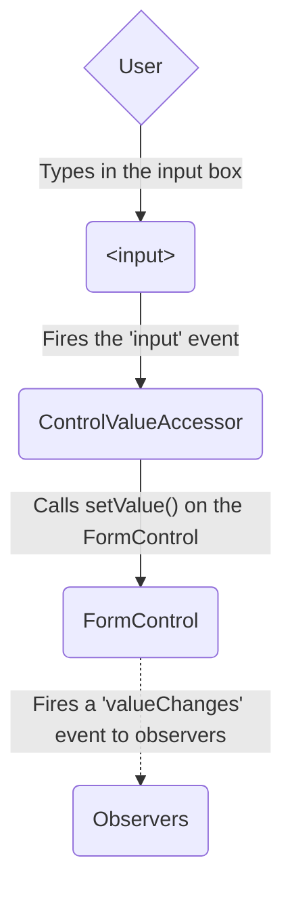
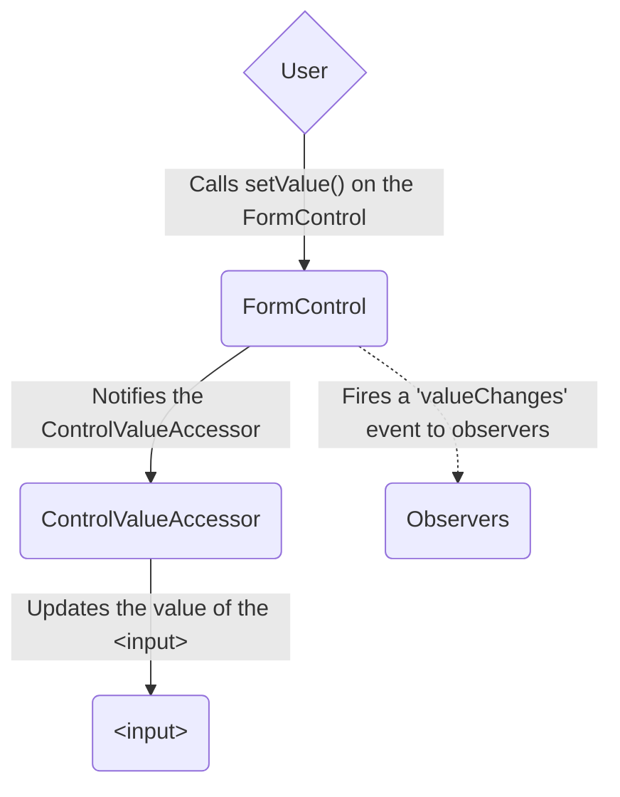
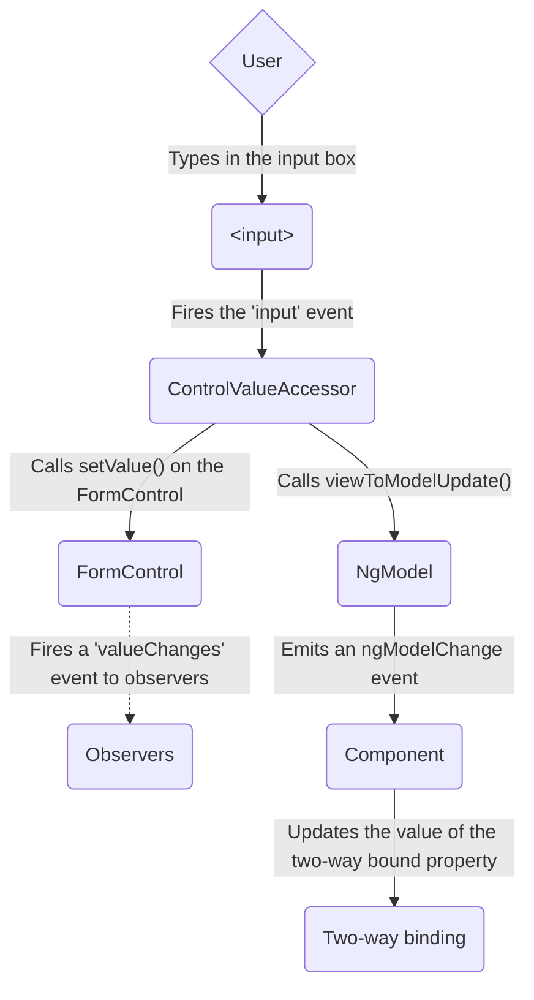
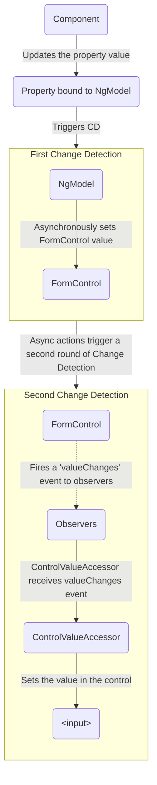

<docs-decorative-header title="Angularのフォーム" imgSrc="adev/src/assets/images/overview.svg"> <!-- markdownlint-disable-line -->
フォームを使ったユーザー入力の処理は、多くの一般的なアプリケーションの基盤となっています。
</docs-decorative-header>

アプリケーションは、ユーザーのログインやプロフィールの更新、機密情報を入力したりその他多くのデータ入力タスクを実行できるようにするために、フォームを使用します。

Angularは、フォームを通じてユーザー入力を処理するために、リアクティブとテンプレート駆動の2つの異なるアプローチを提供します。
どちらもビューからのユーザー入力イベントをキャプチャし、ユーザー入力を検証してフォームモデルとデータモデルを作成して更新し、変更を追跡する方法を提供します。

このガイドは、状況に合わせてどちらのタイプのフォームが最適か判断するのに役立つ情報を提供します。
両方のアプローチで使用される一般的なビルディングブロックを紹介します。
また、2つのアプローチの主な違いをまとめ、セットアップ、データフロー、テストというコンテキストにおけるそれらの違いを示します。

## アプローチの選択 {#choosing-an-approach}

リアクティブフォームとテンプレート駆動フォームは、フォームデータを処理および管理する方法が異なります。
それぞれのアプローチは、異なる利点を提供します。

| フォーム               | 詳細 |
|:---                   |:---     |
| リアクティブフォーム        | フォームの基礎となるオブジェクトモデルに直接的で明示的なアクセスを提供します。テンプレート駆動フォームと比較して、より堅牢です。スケーラビリティ、再利用性、テスト性が向上します。フォームがアプリケーションの重要な部分である場合、またはアプリケーションの構築にリアクティブパターンをすでに使用している場合は、リアクティブフォームを使用します。                                                                                             |
| テンプレート駆動フォーム | テンプレート内のディレクティブに依存して、基礎となるオブジェクトモデルを作成および操作します。メールリスト登録フォームなどの、アプリケーションに簡単なフォームを追加するのに役立ちます。アプリケーションへの追加は簡単ですが、リアクティブフォームほどスケーラブルではありません。非常に基本的なフォーム要件と、テンプレートだけで管理できるロジックがある場合は、テンプレート駆動フォームが適している可能性があります。 |

### 主要な違い

次の表は、リアクティブフォームとテンプレート駆動フォームの主な違いをまとめたものです。

|                                                    | リアクティブ                         | テンプレート駆動                 |
|:---                                                |:---                                 |:---                             |
| [フォームモデルのセットアップ](#setting-up-the-form-model)  | 明示的、コンポーネントクラスで作成 | 黙示的、ディレクティブによって作成 |
| [データモデル](#mutability-of-the-data-model)        | 構造化され、不変                      | 構造化されていない、可変        |
| [データフロー](#data-flow-in-forms)                     | 同期                            | 非同期                          |
| [フォームバリデーション](#form-validation)                | 関数                             | ディレクティブ                    |

### スケーラビリティ

フォームがアプリケーションの中心的な部分である場合は、スケーラビリティが非常に重要です。
フォームモデルをコンポーネント間で再利用できることは不可欠です。

リアクティブフォームは、テンプレート駆動フォームよりもスケーラブルです。
フォームの基礎となるAPIに直接アクセスでき、[同期データフロー](#data-flow-in-reactive-forms) をビューとデータモデルの間で使用するため、大規模なフォームの作成が容易になります。
リアクティブフォームは、テストのためのセットアップが少なく、テストにはフォームの更新とバリデーションを適切にテストするために変更検知の深い理解は必要ありません。

テンプレート駆動フォームは、単純なシナリオに焦点を当て、再利用性がそれほど高くありません。
フォームの基礎となるAPIを抽象化し、[非同期データフロー](#data-flow-in-template-driven-forms) をビューとデータモデルの間で使用します。
テンプレート駆動フォームの抽象化は、テストにも影響を与えます。
テストは、適切に実行するために手動で変更検知を実行することに大きく依存し、より多くのセットアップが必要です。

## フォームモデルのセットアップ {#setting-up-the-form-model}

リアクティブフォームとテンプレート駆動フォームの両方とも、ユーザーが対話するフォーム入力要素と、コンポーネントモデル内のフォームデータの間の値の変更を追跡します。
2つのアプローチは、基礎となるビルディングブロックを共有しますが、共通のフォームコントロールインスタンスの作成と管理方法が異なります。

### 共通のフォーム基盤クラス

リアクティブフォームとテンプレート駆動フォームの両方は、次のベースクラスに基づいて構築されています。

| ベースクラス           | 詳細 |
|:---                    |:---     |
| `FormControl`          | 個々のフォームコントロールの値と検証ステータスを追跡します。               |
| `FormGroup`            | フォームコントロールのコレクションの値とステータスを追跡します。                |
| `FormArray`            | フォームコントロールの配列の値とステータスを追跡します。                    |
| `ControlValueAccessor` | Angular の `FormControl` インスタンスと組み込みの DOM 要素の橋渡しを作成します。 |

### リアクティブフォームでのセットアップ

リアクティブフォームでは、フォームモデルをコンポーネントクラスに直接定義します。
`[formControl]` ディレクティブは、明示的に作成された `FormControl` インスタンスを、内部の値アクセサーを使用して、ビュー内の特定のフォーム要素にリンクします。

次のコンポーネントは、リアクティブフォームを使用して、単一コントロールの入力フィールドを実装しています。
この例では、フォームモデルは `FormControl` インスタンスです。

<docs-code path="adev/src/content/examples/forms-overview/src/app/reactive/favorite-color/favorite-color.component.ts"/>

IMPORTANT: リアクティブフォームでは、フォームモデルが真実の源です。`<input>` 要素の `[formControl]` ディレクティブを通じて、特定の時点におけるフォーム要素の値とステータスを提供します。

### テンプレート駆動フォームでのセットアップ

テンプレート駆動フォームにおいてフォームモデルは暗黙的であり、明示的ではありません。
`NgModel` ディレクティブは、特定のフォーム要素の `FormControl` インスタンスを作成および管理します。

次のコンポーネントは、テンプレート駆動フォームを使用して、単一コントロールの同じ入力フィールドを実装しています。

<docs-code path="adev/src/content/examples/forms-overview/src/app/template/favorite-color/favorite-color.component.ts"/>

IMPORTANT: テンプレート駆動フォームでは、真実の源はテンプレートです。`NgModel` ディレクティブは、`FormControl` インスタンスを自動的に管理します。

## フォーム内のデータフロー {#data-flow-in-forms}

アプリケーションにフォームが含まれている場合、Angularはビューをコンポーネントモデルと同期させ、コンポーネントモデルをビューと同期させる必要があります。
ユーザーがビューを通じて値を変更したり選択したりすると、新しい値はデータモデルに反映される必要があります。
同様に、プログラムロジックがデータモデルの値を変更すると、これらの値はビューに反映される必要があります。

リアクティブフォームとテンプレート駆動フォームは、ユーザーからの変更またはプログラムによる変更からデータが流れる方法が異なります。
次の図は、上記で定義されたお気に入りの色の入力フィールドを使用して、各タイプのフォームの両方のデータフローを示しています。

### リアクティブフォームのデータフロー

リアクティブフォームでは、ビュー内の各フォーム要素は、フォームモデル（`FormControl` インスタンス）に直接リンクされています。
ビューからモデルへの更新、およびモデルからビューへの更新は同期であり、UIのレンダリング方法に依存しません。

ビューからモデルへの図は、入力フィールドの値がビューから変更された場合にデータがどのように流れるかを示しています。

1. ユーザーは入力要素にお気に入りの色 *Blue* を入力します。
1. フォーム入力要素は、最新の値を伴う "input" イベントを発行します。
1. フォーム入力要素のイベントをリッスンしている `ControlValueAccessor` は、新しい値を `FormControl` インスタンスにすぐに中継します。
1. `FormControl` インスタンスは、`valueChanges` Observableを通じて新しい値を発行します。
1. `valueChanges` Observableのサブスクライバーは、新しい値を受け取ります。

モデルからビューへの図は、モデルに対するプログラムによる変更がどのようにビューに伝播されるかを示しています。

1. ユーザーは `favoriteColorControl.setValue()` メソッドを呼び出し、`FormControl` の値を更新します。
1. `FormControl` インスタンスは、`valueChanges` Observableを通じて新しい値を発行します。
1. `valueChanges` Observableのサブスクライバーは、新しい値を受け取ります。
1. フォーム入力要素の制御値アクセサーは、新しい値で要素を更新します。

### テンプレート駆動フォームのデータフロー

テンプレート駆動フォームでは、各フォーム要素は、フォームモデルを内部的に管理するディレクティブにリンクされています。

ビューからモデルへの図は、入力フィールドの値がビューから変更された場合にデータがどのように流れるかを示しています。

1. ユーザーは入力要素に *Blue* を入力します。
1. 入力要素は、値 *Blue* を伴う "input" イベントを発行します。
1. 入力に接続された制御値アクセサーは、`FormControl` インスタンスの `setValue()` メソッドをトリガーします。
1. `FormControl` インスタンスは、`valueChanges` Observableを通じて新しい値を発行します。
1. `valueChanges` Observableのサブスクライバーは、新しい値を受け取ります。
1. 制御値アクセサーは、`ngModelChange` イベントを発行する `NgModel.viewToModelUpdate()` メソッドも呼び出します。
1. コンポーネントテンプレートが `favoriteColor` プロパティに対して双方向バインディングを使用しているため、コンポーネントの `favoriteColor` プロパティは、`ngModelChange` イベント（*Blue*）によって発行された値に更新されます。

モデルからビューへの図は、`favoriteColor` が *Blue* から *Red* に変更された場合に、データがモデルからビューにどのように流れるかを示しています。

1. コンポーネントで `favoriteColor` 値が更新されます。
1. 変更検知が開始されます。
1. 変更検知中に、`NgModel` ディレクティブインスタンスの入力の1つが変更されたため、`ngOnChanges` ライフサイクルフックが呼び出されます。
1. `ngOnChanges()` メソッドは、内部 `FormControl` インスタンスの値を設定するための非同期タスクをキューに入れます。
1. 変更検知が完了します。
1. 次のティックで、`FormControl` インスタンスの値を設定するタスクが実行されます。
1. `FormControl` インスタンスは、`valueChanges` Observableを通じて最新の値を発行します。
1. `valueChanges` Observableのサブスクライバーは、新しい値を受け取ります。
1. 制御値アクセサーは、ビュー内のフォーム入力要素を、最新の `favoriteColor` 値で更新します。

Note: `NgModel` は、値の変更が入力バインディングから発生するため、`ExpressionChangedAfterItHasBeenChecked` エラーを回避するために2回目の変更検知をトリガーします。

### データモデルの可変性 {#mutability-of-the-data-model}

変更追跡の方法は、アプリケーションの効率に影響を与えます。

| フォーム               | 詳細 |
|:---                   |:---     |
| リアクティブフォーム        | データモデルを、不変のデータ構造として提供することで、データモデルを純粋に保ちます。データモデルで変更がトリガーされるたびに、`FormControl` インスタンスは、既存のデータモデルを更新するのではなく、新しいデータモデルを返します。これにより、コントロールのObservableを通じて、データモデルに対する一意の変更を追跡できます。変更検知は、一意の変更でのみ更新する必要があるため、より効率的です。データの更新はリアクティブパターンに従うため、Observableオペレーターと統合してデータを変更できます。 |
| テンプレート駆動フォーム | テンプレートでの変更が行われると、コンポーネント内のデータモデルを更新するために、双方向バインディングを使用して可変性を活用します。双方向バインディングを使用する場合は、データモデルに対する一意の変更を追跡できないため、変更検知は、更新が必要なときに判断する効率が低くなります。                                                                                                                                                                                                                                 |

この違いは、お気に入りの色の入力要素を使用する前の例で示されています。

* リアクティブフォームの場合、**`FormControl` インスタンス** は、コントロールの値が更新されると常に新しい値を返します
* テンプレート駆動フォームの場合、**お気に入りの色のプロパティ** は、常にその新しい値に変更されます

## フォームバリデーション {#form-validation}

バリデーションは、フォームのセットを管理する上で不可欠な部分です。
必須フィールドを確認しているか、外部APIに既存のユーザー名を確認しているかにかかわらず、Angularは一連の組み込みバリデーターと、カスタムバリデーターを作成する機能を提供します。

| フォーム               | 詳細 |
|:---                   |:---     |
| リアクティブフォーム        | バリデートするコントロールを受け取る**関数**として、カスタムバリデーターを定義します                                 |
| テンプレート駆動フォーム | テンプレート**ディレクティブ**に結び付けられ、バリデーション関数をラップするカスタムバリデーターディレクティブを提供する必要があります |

詳細については、[フォームバリデーション](guide/forms/form-validation#validating-input-in-reactive-forms) を参照してください。

## テスト

テストは、複雑なアプリケーションで重要な役割を果たします。
フォームが正しく機能することを検証する際に、より簡単なテスト戦略が役立ちます。
リアクティブフォームとテンプレート駆動フォームは、UIをレンダリングすることに対して異なるレベルの依存関係があり、フォームコントロールとフォームフィールドの変更に基づいてアサーションを実行します。
次の例は、リアクティブフォームとテンプレート駆動フォームを使用してフォームをテストするプロセスを示しています。

### リアクティブフォームのテスト

リアクティブフォームは、フォームとデータモデルに同期的にアクセスできるため、比較的簡単なテスト戦略を提供し、UIをレンダリングせずにテストできます。
これらのテストでは、ステータスとデータは、変更検知サイクルと対話せずに、コントロールを通じてクエリおよび操作されます。

次のテストは、前の例にあるお気に入りの色のコンポーネントを使用して、リアクティブフォームのビューからモデルへのデータフロー、およびモデルからビューへのデータフローを確認します。

<!--todo: make consistent with other topics -->

#### ビューからモデルへのデータフローを確認する

最初の例は、ビューからモデルへのデータフローを確認するために、次の手順を実行します。

1. ビューからフォーム入力要素をクエリし、テスト用のカスタム "input" イベントを作成します。
1. 入力の新しい値を *Red* に設定し、フォーム入力要素で "input" イベントをディスパッチします。
1. コンポーネントの `favoriteColorControl` 値が入力からの値と一致することをアサートします。

<docs-code header="お気に入りの色のテスト - ビューからモデルへ" path="adev/src/content/examples/forms-overview/src/app/reactive/favorite-color/favorite-color.component.spec.ts" visibleRegion="view-to-model"/>

次の例は、モデルからビューへのデータフローを確認するために、次の手順を実行します。

1. `favoriteColorControl`（`FormControl` インスタンス）を使用して、新しい値を設定します。
1. ビューからフォーム入力要素をクエリします。
1. コントロールに設定された新しい値が入力内の値と一致することをアサートします。

<docs-code header="お気に入りの色のテスト - モデルからビューへ" path="adev/src/content/examples/forms-overview/src/app/reactive/favorite-color/favorite-color.component.spec.ts" visibleRegion="model-to-view"/>

### テンプレート駆動フォームのテスト

テンプレート駆動フォームでテストを作成するには、変更検知プロセスの詳細な知識と、各サイクルでディレクティブがどのように実行されるかを理解する必要があり、要素が適切なタイミングでクエリ、テスト、変更されることを保証します。

次のテストは、先に述べたお気に入りの色のコンポーネントを使用して、テンプレート駆動フォームのビューからモデルへのデータフロー、およびモデルからビューへのデータフローを確認します。

次のテストは、ビューからモデルへのデータフローを確認します。

<docs-code header="お気に入りの色のテスト - ビューからモデルへ" path="adev/src/content/examples/forms-overview/src/app/template/favorite-color/favorite-color.component.spec.ts" visibleRegion="view-to-model"/>

ビューからモデルへのテストで実行される手順を以下に示します。

1. ビューからフォーム入力要素をクエリし、テスト用のカスタム "input" イベントを作成します。
1. 入力の新しい値を *Red* に設定し、フォーム入力要素で "input" イベントをディスパッチします。
1. テストフィクスチャを通じて変更検知を実行します。
1. コンポーネントの `favoriteColor` プロパティ値が入力からの値と一致することをアサートします。

次のテストは、モデルからビューへのデータフローを確認します。

<docs-code header="お気に入りの色のテスト - モデルからビューへ" path="adev/src/content/examples/forms-overview/src/app/template/favorite-color/favorite-color.component.spec.ts" visibleRegion="model-to-view"/>

モデルからビューへのテストで実行される手順を以下に示します。

1. コンポーネントインスタンスを使用して、`favoriteColor` プロパティの値を設定します。
1. テストフィクスチャを通じて変更検知を実行します。
1. `fakeAsync()` タスク内で、`tick()` メソッドを使用して時間の経過をシミュレートします。
1. ビューからフォーム入力要素をクエリします。
1. 入力の値が、コンポーネントインスタンスの `favoriteColor` プロパティの値と一致することをアサートします。

## 次のステップ

リアクティブフォームの詳細については、次のガイドを参照してください。

<docs-pill-row>
  <docs-pill href="guide/forms/reactive-forms" title="リアクティブフォーム"/>
  <docs-pill href="guide/forms/form-validation#validating-input-in-reactive-forms" title="フォームバリデーション"/>
  <docs-pill href="guide/forms/dynamic-forms" title="動的フォーム"/>
</docs-pill-row>

テンプレート駆動フォームの詳細については、次のガイドを参照してください。

<docs-pill-row>
  <docs-pill href="guide/forms/template-driven-forms" title="テンプレート駆動フォームチュートリアル" />
  <docs-pill href="guide/forms/form-validation#validating-input-in-template-driven-forms" title="フォームバリデーション" />
  <docs-pill href="api/forms/NgForm" title="NgForm ディレクティブAPIリファレンス" />
</docs-pill-row>
