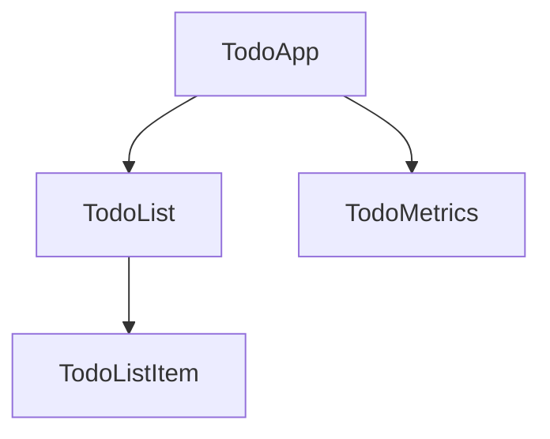

<docs-decorative-header title="コンポーネント" imgSrc="adev/src/assets/images/components.svg"> <!-- markdownlint-disable-line -->
Angularでアプリケーションを作成するための基本的な構成要素。
</docs-decorative-header>

コンポーネントは、プロジェクトを理解しやすい部品に分割し、明確な責任を持たせることで、コードの保守性とスケーラビリティを向上させます。

Todoアプリケーションをコンポーネントのツリーに分解する例を示します。



このガイドでは、Angularでコンポーネントを作成および使用する方法について説明します。

## コンポーネントの定義

すべてのコンポーネントには、核となる次のプロパティがあります。

1. いくつかの設定を含む `@Component`[デコレーター](https://www.typescriptlang.org/docs/handbook/decorators.html)
2. DOMにレンダリングされる内容を制御するHTMLテンプレート
3. HTMLでコンポーネントがどのように使用されるかを定義する [CSSセレクター](https://developer.mozilla.org/docs/Learn/CSS/Building_blocks/Selectors)
4. 状態管理、ユーザー入力処理、サーバーからのデータフェッチなどの動作を持つTypeScriptクラス

TodoListItemコンポーネントの簡略化された例を次に示します。

```angular-ts
// todo-list-item.component.ts
@Component({
  selector: 'todo-list-item',
  template: `
    <li>(TODO) Read Angular Essentials Guide</li>
  `,
})
export class TodoListItem {
  /* コンポーネントの動作はここで定義します。 */
}
```

コンポーネントでよく見られるその他のメタデータには次のものがあります。

- `standalone: true` — コンポーネントの作成を簡素化する推奨アプローチ
- `styles` — コンポーネントに適用するCSSスタイルを含む文字列または文字列の配列

これを踏まえて、`TodoListItem` コンポーネントの更新バージョンを示します。

```angular-ts
// todo-list-item.component.ts
@Component({
  standalone: true,
  selector: 'todo-list-item',
  template: `
    <li>(TODO) Read Angular Essentials Guide</li>
  `,
  styles: `
    li {
      color: red;
      font-weight: 300;
    }
  `,
})
export class TodoListItem {
  /* コンポーネントの動作はここで定義します。 */
}
```

### HTMLとCSSを別ファイルに分離する

HTMLやCSSを別ファイルで管理することを好むチーム向けに、Angularは `templateUrl` と `styleUrl` の2つの追加プロパティを提供します。

前の `TodoListItem` コンポーネントを使用して、代替アプローチは次のようになります。

```angular-ts
// todo-list-item.component.ts
@Component({
  standalone: true,
  selector: 'todo-list-item',
  templateUrl: './todo-list-item.component.html',
  styleUrl: './todo-list-item.component.css',
})
export class TodoListItem {
  /* コンポーネントの動作はここで定義します。 */
}
```

```angular-html
<!-- todo-list-item.component.html -->
<li>(TODO) Read Angular Essentials Guide</li>
```

```css
/* todo-list-item.component.css */
li {
  color: red;
  font-weight: 300;
}
```

## コンポーネントの使用

コンポーネントアーキテクチャの利点の1つは、アプリケーションがモジュール化されることです。つまり、コンポーネントは他のコンポーネントの中で使用できます。

コンポーネントを使用するには、次の手順を実行します。

1. ファイルにコンポーネントをインポートする
2. コンポーネントの `imports` 配列に追加する
3. テンプレートでコンポーネントのセレクターを使用する

前の `TodoListItem` コンポーネントをインポートする `TodoList` コンポーネントの例を次に示します。

```angular-ts
// todo-list.component.ts
import {TodoListItem} from './todo-list-item.component.ts';

@Component({
  standalone: true,
  imports: [TodoListItem],
  template: `
    <ul>
      <todo-list-item></todo-list-item>
    </ul>
  `,
})
export class TodoList {}
```

## 次のステップ

Angularのコンポーネントの仕組みがわかったところで、アプリケーションに動的なデータを追加して管理する方法について学びましょう。

<docs-pill-row>
  <docs-pill title="動的なデータの管理" href="essentials/managing-dynamic-data" />
</docs-pill-row>
