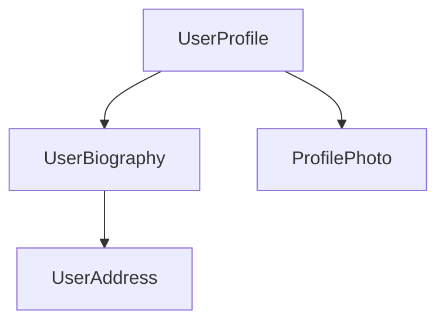

<docs-decorative-header title="コンポーネント" imgSrc="adev/src/assets/images/components.svg"> <!-- markdownlint-disable-line -->
Angularでアプリケーションを作成するための基本的な構成要素
</docs-decorative-header>

コンポーネントは、Angularアプリケーションの主要な構成要素です。各コンポーネントは、より大きなウェブページの一部を表します。アプリケーションをコンポーネントに整理することで、プロジェクトに構造が与えられ、コードが特定の部分に明確に分割されるため、保守と拡張が容易になります。

## コンポーネントの定義

すべてのコンポーネントには、いくつかの主要な部分があります。

1. Angularによって使用されるいくつかの設定を含む`@Component`[デコレーター](https://www.typescriptlang.org/docs/handbook/decorators.html)。
2. DOMにレンダリングされる内容を制御するHTMLテンプレート。
3. HTMLでコンポーネントがどのように使用されるかを定義する[CSSセレクター](https://developer.mozilla.org/docs/Learn/CSS/Building_blocks/Selectors)。
4. ユーザー入力の処理やサーバーへのリクエストの実行など、動作を定義するTypeScriptクラス。

`UserProfile`コンポーネントの簡略化された例を以下に示します。

```angular-ts
// user-profile.ts
@Component({
  selector: 'user-profile',
  template: `
    <h1>User profile</h1>
    <p>This is the user profile page</p>
  `,
})
export class UserProfile { /* Your component code goes here */ }
```

`@Component`デコレーターは、テンプレートに適用するCSSを指定するために、オプションで`styles`プロパティも受け付けます。

```angular-ts
// user-profile.ts
@Component({
  selector: 'user-profile',
  template: `
    <h1>User profile</h1>
    <p>This is the user profile page</p>
  `,
  styles: `h1 { font-size: 3em; } `,
})
export class UserProfile { /* Your component code goes here */ }
```

### HTMLとCSSを別々のファイルに分離する

`templateUrl`と`styleUrl`を使用して、コンポーネントのHTMLとCSSを別々のファイルで定義できます。

```angular-ts
// user-profile.ts
@Component({
  selector: 'user-profile',
  templateUrl: 'user-profile.html',
  styleUrl: 'user-profile.css',
})
export class UserProfile {
  // コンポーネントの動作はここに定義されます
}
```

```angular-html
<!-- user-profile.html -->
<h1>Use profile</h1>
<p>This is the user profile page</p>
```

```css
/* user-profile.css */
h1 {
  font-size: 3em;
}
```

## コンポーネントの使用

複数のコンポーネントを組み合わせてアプリケーションを構築します。例えば、ユーザープロフィールページを構築する場合、ページを次のような複数のコンポーネントに分割できます。



ここでは、`UserProfile`コンポーネントは他のいくつかのコンポーネントを使用して最終的なページを作成します。

コンポーネントをインポートして使用するには、次の手順が必要です。
1. コンポーネントのTypeScriptファイルで、使用するコンポーネントの`import`文を追加します。
2. `@Component`デコレーターで、使用するコンポーネントの`imports`配列にエントリを追加します。
3. コンポーネントのテンプレートで、使用するコンポーネントのセレクターと一致する要素を追加します。

`UserProfile`コンポーネントが`ProfilePhoto`コンポーネントをインポートする例を以下に示します。

```angular-ts
// user-profile.ts
import {ProfilePhoto} from 'profile-photo.ts';

@Component({
  selector: 'user-profile',
  imports: [ProfilePhoto],
  template: `
    <h1>User profile</h1>
    <profile-photo />
    <p>This is the user profile page</p>
  `,
})
export class UserProfile {
  // コンポーネントの動作はここに定義されます
}
```

Tip: Angularコンポーネントについてもっと知りたいですか？ 詳細については、[詳細なコンポーネントガイド](guide/components)を参照してください。

## 次の手順

Angularでのコンポーネントの動作が分かったところで、アプリケーションに動的なデータをどのように追加して管理するかを学ぶ時です。

<docs-pill-row>
  <docs-pill title="シグナルによるリアクティビティ" href="essentials/signals" />
  <docs-pill title="詳細なコンポーネントガイド" href="guide/components" />
</docs-pill-row>
