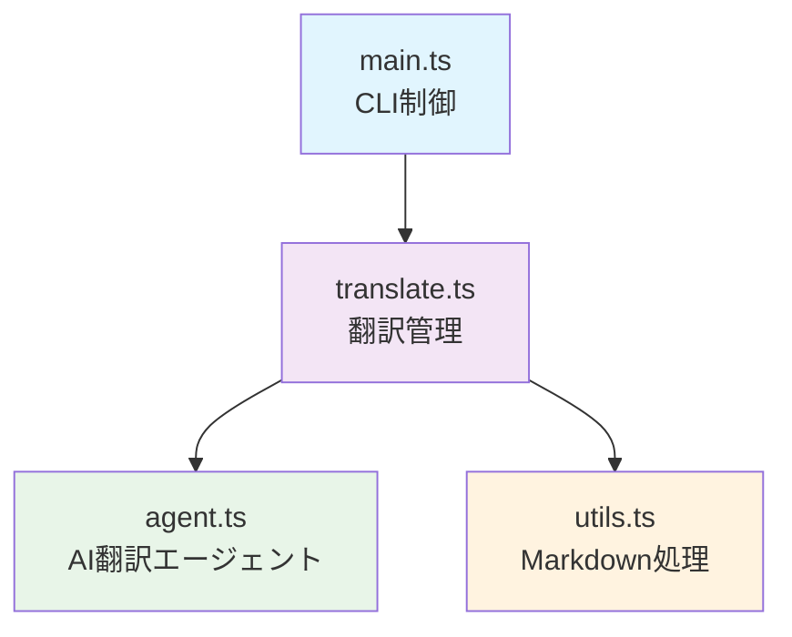

# Translator Tool

MarkdownファイルをGoogle Gemini APIを使用して日本語に翻訳するCLIツール

## 概要

このツールは、Angularドキュメントの英語版Markdownファイルを高品質な日本語に自動翻訳するために開発されました。AI翻訳と自動校正を組み合わせることで、一貫性のある翻訳品質を実現します。

### 主な機能

- **AI翻訳**: Google Gemini APIを使用した高精度な英日翻訳
- **自動校正**: textlintによる日本語文章の品質チェックと修正
- **ブロック分割**: 大きなMarkdownファイルを見出し単位で分割処理
- **レート制限**: API制限に配慮した段階的処理
- **ファイル管理**: 原文ファイル（.en.md）と翻訳ファイル（.md）の自動管理

## 使用方法

### 前提条件

1. Google AI Studio でAPIキーを取得
   - https://aistudio.google.com/app/apikey
   
2. 環境変数を設定
```bash
export GOOGLE_API_KEY="your-api-key"
export GEMINI_MODEL="gemini-2.5-flash-preview-05-20"  # オプション
```

### コマンド実行

```bash
# 基本的な使用方法
yarn translate path/to/file.md

# 確認なしで保存
yarn translate -w path/to/file.md

# ヘルプ表示
yarn translate --help
```

### オプション

- `-w, --write`: 確認プロンプトなしで翻訳結果を自動保存
- `-h, --help`: 使用方法を表示

## ファイル構成

```
tools/translator/
├── README.md          # このファイル
├── main.ts           # CLIエントリーポイント
├── translate.ts      # 翻訳処理の主要ロジック
├── agent.ts          # LangChainベースの翻訳エージェント
└── utils.ts          # Markdown処理ユーティリティ
```

## 内部実装の設計

### アーキテクチャ



### コンポーネント詳細

#### main.ts
- **責任**: CLI制御とワークフロー管理
- **設計パターン**: 単一責任の原則に基づく関数分離
- **主要機能**:
  - 環境変数・引数の検証
  - ファイル存在確認
  - ヘルプ表示
  - 保存確認プロンプト

#### translate.ts
- **責任**: 翻訳処理の統合管理
- **設計パターン**: ファサードパターン
- **主要機能**:
  - Markdownファイルの分割処理
  - 進捗表示
  - レート制限制御
  - 翻訳結果の統合

#### agent.ts
- **責任**: AI翻訳の実行
- **設計パターン**: LangChainのRunnableチェーン
- **主要機能**:
  - 翻訳プロンプトの管理
  - 翻訳 → 校正の2段階処理
  - textlintによる品質チェック

#### utils.ts
- **責任**: Markdown処理ユーティリティ
- **設計パターン**: Pure Functions
- **主要機能**:
  - 見出し単位でのMarkdown分割
  - 翻訳ブロックの再統合
